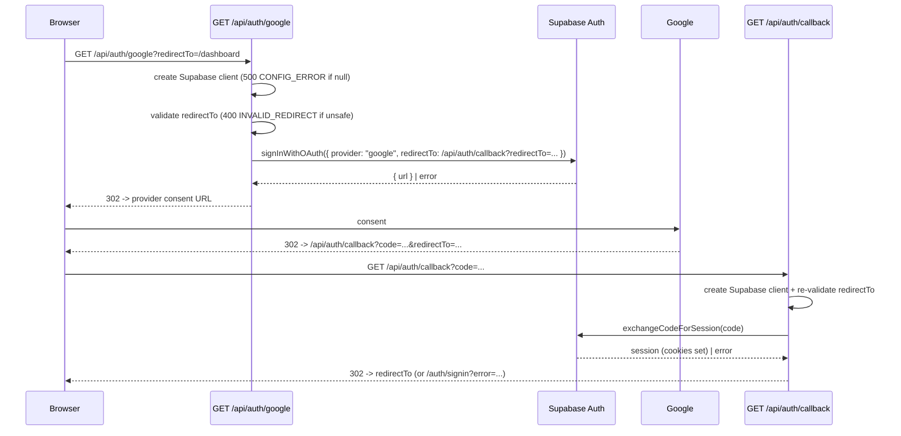

# API Endpoint Implementation Plan: GET /api/auth/google (Start Google OAuth)

## 1. Endpoint Overview

This endpoint starts the Supabase Google OAuth login flow. It does not return a
JSON body; instead it issues an HTTP redirect to the Google consent screen
generated by Supabase. After the user authorizes the app, Google redirects back
to a server-side callback route (`GET /api/auth/callback`) which exchanges the
authorization `code` for a session and sets the Supabase session cookies. The
callback then redirects the user to the originally requested `redirectTo` path.

Google OAuth is the only registration/login method targeted by the MVP (see
[.ai/api-plan.md](.ai/api-plan.md), section 2.1 and section 3). The endpoint is
server-side rendered (Astro SSR on Cloudflare Workers) and uses the same
cookie-based Supabase SSR client as the rest of the app
([src/lib/supabase.ts](src/lib/supabase.ts),
[src/middleware.ts](src/middleware.ts)).

Because OAuth requires a redirect target to complete the PKCE code exchange,
this plan covers **two** routes that together implement the flow:

- `GET /api/auth/google` — starts the flow (the documented endpoint).
- `GET /api/auth/callback` — completes the flow (a required supporting route).

Key business rules:

- `redirectTo` is an **optional, relative** path. It defaults to `/dashboard`.
- Only same-origin relative paths are allowed for `redirectTo` to prevent open
  redirects → otherwise `400 INVALID_REDIRECT`.
- The Supabase OAuth `redirectTo` (the provider callback) always points at the
  app's own `/api/auth/callback`, never at a client-supplied absolute URL.
- The final post-login destination is derived only from the validated
  `redirectTo`, never from the OAuth provider response.
- No session is required to call this endpoint (it is the entry point to login).

## 2. Request Details

### 2.1 `GET /api/auth/google`

- **HTTP Method:** `GET`
- **URL:** `/api/auth/google`
- **Headers:**
  - Supabase cookies are optional (the user is typically unauthenticated here).
- **Parameters:**
  - **Required:** none
  - **Optional:**
    - `redirectTo` — `string`, a **relative** path (must start with a single `/`
      and not `//`). Defaults to `/dashboard`. Used to return the user to the
      intended page after login.
- **Request Body:** none (GET request).

### 2.2 `GET /api/auth/callback` (supporting route)

- **HTTP Method:** `GET`
- **URL:** `/api/auth/callback`
- **Parameters:**
  - `code` — `string`, required, supplied by Supabase/Google. Exchanged for a
    session server-side.
  - `redirectTo` — `string`, optional, relative, forwarded from the start route;
    re-validated before use. Defaults to `/dashboard`.
  - `error` / `error_description` — optional, present when the provider denies
    or cancels the consent.
- **Request Body:** none (GET request).

## 3. Types Used

From [src/types.ts](src/types.ts):

- `StartGoogleOAuthQuery` — `{ redirectTo?: string }` — query model for the
  start route.
- `ApiErrorDto` — consistent error envelope `{ error: { code, message, details? } }`
  (used only for the JSON error paths, e.g. `INVALID_REDIRECT`).

New (to be created):

- Zod schema `startGoogleOAuthQuerySchema` in `src/lib/validation/auth.ts`
  validating an optional, relative `redirectTo` (default `/dashboard`).
- A small helper `isSafeRelativePath(path: string): boolean` (in
  `src/lib/validation/auth.ts`) shared by both routes to reject open redirects.

No new service module is strictly required: the OAuth start/callback logic is
thin and lives in the route handlers, mirroring the existing auth routes
([src/pages/api/auth/signin.ts](src/pages/api/auth/signin.ts),
[src/pages/api/auth/signout.ts](src/pages/api/auth/signout.ts)). A small
`auth.service.ts` may be introduced if the team prefers to keep routes
declarative; it is optional for MVP.

## 4. Response Details

### 4.1 `GET /api/auth/google`

- **302 Found** — redirect to the Google OAuth consent screen (the `Location`
  header is the provider URL returned by `supabase.auth.signInWithOAuth`).
- **Status codes:**
  - `302 Found` — redirect started successfully.
  - `400 Bad Request` — `INVALID_REDIRECT`, `redirectTo` is not an allowed
    relative path.
  - `500 Internal Server Error` — `CONFIG_ERROR` (Supabase not configured) or
    `OAUTH_START_FAILED` (Supabase failed to produce an authorization URL).

### 4.2 `GET /api/auth/callback`

- **302 Found** — on success, redirect to the validated `redirectTo`
  (default `/dashboard`) with the session cookies set.
- On failure (denied consent, missing/invalid `code`, exchange error) →
  `302 Found` redirect to `/auth/signin?error=...` with a friendly,
  non-technical message (consistent with the existing
  [src/pages/auth/signin.astro](src/pages/auth/signin.astro) error handling).

JSON `ApiErrorDto` is used only for the `INVALID_REDIRECT` / `CONFIG_ERROR`
cases on the start route; the user-facing failure paths use redirects so the
browser lands on a rendered page rather than raw JSON.

## 5. Data Flow

Details:

1. The browser hits `GET /api/auth/google` (optionally with `redirectTo`).
2. The route creates the Supabase SSR client via
   `createClient(request.headers, cookies)`; if `null` → `500 CONFIG_ERROR`.
3. `redirectTo` is validated by `startGoogleOAuthQuerySchema`
   (`isSafeRelativePath`); invalid → `400 INVALID_REDIRECT`.
4. The route calls
   `supabase.auth.signInWithOAuth({ provider: "google", options: { redirectTo } })`,
   where `redirectTo` is the **absolute** URL of the app's own
   `/api/auth/callback`, carrying the validated app-level `redirectTo` as a
   query parameter. The callback origin is derived from the incoming request URL.
5. On success Supabase returns `{ data: { url } }`; the route issues
   `context.redirect(url, 302)`. On error → `500 OAUTH_START_FAILED`.
6. Google redirects back to `/api/auth/callback?code=...&redirectTo=...`.
7. The callback re-validates `redirectTo`, calls
   `supabase.auth.exchangeCodeForSession(code)` (the `@supabase/ssr` client
   writes session cookies through the `setAll` cookie adapter), and redirects to
   the validated destination. Any error (denied consent, missing `code`,
   exchange failure) redirects to `/auth/signin?error=...`.

## 6. Security Considerations

- **Open redirect prevention:** `redirectTo` must be a relative same-origin path
  (`^/(?!/)`), validated on **both** the start and callback routes. Absolute
  URLs, protocol-relative `//host`, and back-references are rejected. This is the
  primary OWASP concern (A01/A10) for this flow.
- **Provider callback target:** the OAuth `redirectTo` passed to Supabase is
  always the app's own `/api/auth/callback` built from the request origin, never
  a client-supplied absolute URL.
- **PKCE / code exchange server-side:** the authorization `code` is exchanged on
  the server via `@supabase/ssr`, so tokens are set as secure cookies and never
  exposed to client JavaScript.
- **No secrets in the client:** only `SUPABASE_URL`/`SUPABASE_KEY` (anon) are
  used; no provider client secret is handled by app code.
- **CSRF:** these are GET navigations that begin/finish an OAuth handshake; state
  integrity is provided by Supabase's PKCE `state`/`code_verifier`. No app-level
  mutation occurs on the start route.
- **No sensitive logging:** never log the `code`, tokens, or full provider
  responses; log only generic error objects via `console.error`.
- **Config guard:** when Supabase env vars are missing, fail closed with
  `500 CONFIG_ERROR` rather than attempting the flow.

## 7. Error Handling

| Scenario                                          | Route    | Result                            | `error.code`         |
| ------------------------------------------------- | -------- | --------------------------------- | -------------------- |
| Supabase not configured (`createClient` → `null`) | google   | 500 JSON                          | `CONFIG_ERROR`       |
| `redirectTo` is absolute / protocol-relative      | google   | 400 JSON                          | `INVALID_REDIRECT`   |
| `signInWithOAuth` returns an error / no URL       | google   | 500 JSON                          | `OAUTH_START_FAILED` |
| Provider denied/cancelled (`error` param present) | callback | 302 → `/auth/signin?error=...`    | n/a (redirect)       |
| Missing or invalid `code`                         | callback | 302 → `/auth/signin?error=...`    | n/a (redirect)       |
| `exchangeCodeForSession` fails                    | callback | 302 → `/auth/signin?error=...`    | n/a (redirect)       |
| `redirectTo` invalid on callback                  | callback | 302 → `/dashboard` (safe default) | n/a (redirect)       |

Handling rules:

- The start route returns the `ApiErrorDto` envelope via `jsonError` from
  [src/lib/api/responses.ts](src/lib/api/responses.ts) for its error cases.
- The callback always resolves to a user-facing rendered page (success
  destination or sign-in page with a friendly message), never raw JSON.
- The project has no error table; technical details are only logged at runtime
  (`console.error`), consistent with existing routes.

## 8. Performance Considerations

- Both routes are lightweight: a single Supabase auth call plus a redirect.
- `signInWithOAuth` performs no database query; `exchangeCodeForSession` is a
  single token exchange. No app tables are read or written.
- Enforce `export const prerender = false;` so both routes run in SSR mode on
  Cloudflare Workers.
- No caching: auth redirects must never be cached (rely on default no-store
  behaviour for dynamic SSR responses).

## 9. Implementation Steps

1. **Validation:** create `src/lib/validation/auth.ts`:
   - `isSafeRelativePath(path)` — returns `true` only for paths matching
     `^/(?!/)` (single leading slash, not protocol-relative, no scheme).
   - `startGoogleOAuthQuerySchema` — `z.object({ redirectTo: z.string().optional() })`
     refined with `isSafeRelativePath`, defaulting to `/dashboard`.
2. **Start route:** create `src/pages/api/auth/google.ts`:
   - `export const prerender = false;`
   - `export const GET: APIRoute = async (context) => { ... }`:
     - create the Supabase client (`createClient`) → `500 CONFIG_ERROR` if `null`,
     - parse + validate `redirectTo` → `400 INVALID_REDIRECT` on failure,
     - build the absolute callback URL from `context.url.origin` +
       `/api/auth/callback?redirectTo=<validated>`,
     - call `supabase.auth.signInWithOAuth({ provider: "google", options: { redirectTo } })`,
     - on error or missing `data.url` → `500 OAUTH_START_FAILED`,
     - else `return context.redirect(data.url, 302)`.
3. **Callback route:** create `src/pages/api/auth/callback.ts`:
   - `export const prerender = false;`
   - `export const GET: APIRoute = async (context) => { ... }`:
     - read `code`, `error`, and `redirectTo` from `context.url.searchParams`,
     - if `error` or no `code` → `redirect('/auth/signin?error=...')`,
     - create the Supabase client → on missing config redirect to sign-in with a
       friendly message,
     - `await supabase.auth.exchangeCodeForSession(code)`; on error → redirect to
       sign-in with a friendly message,
     - re-validate `redirectTo` (fallback `/dashboard`) and
       `return context.redirect(safeRedirect, 302)`.
4. **UI hook:** add a "Continue with Google" link/button to
   [src/pages/auth/signin.astro](src/pages/auth/signin.astro) and
   [src/pages/auth/signup.astro](src/pages/auth/signup.astro) pointing at
   `/api/auth/google` (optionally with `?redirectTo=`).
5. **Types:** confirm `StartGoogleOAuthQuery` in [src/types.ts](src/types.ts)
   matches the schema; no new shared types are required.
6. **Supabase configuration (out of code):** enable the Google provider in the
   Supabase dashboard and register the allowed redirect URL
   (`<app-origin>/api/auth/callback`) for local and deployed environments.
7. **Tests:**
   - `src/pages/api/auth/google.test.ts` — `500 CONFIG_ERROR` when unconfigured,
     `400 INVALID_REDIRECT` for an absolute/`//` path, `302` to the provider URL
     on success (mock `signInWithOAuth`), `500 OAUTH_START_FAILED` on provider
     error.
   - `src/pages/api/auth/callback.test.ts` — success exchange → redirect to
     `redirectTo`; denied consent / missing `code` / exchange error → redirect to
     `/auth/signin?error=...`; unsafe `redirectTo` falls back to `/dashboard`.
8. **Quality verification:** run `npm run lint` and `npm run build`; fix any
   type/lint issues.
9. **(Optional)** add request entries to
   [insomnia/decks-api.json](insomnia/decks-api.json) if the team maintains a
   request collection.
