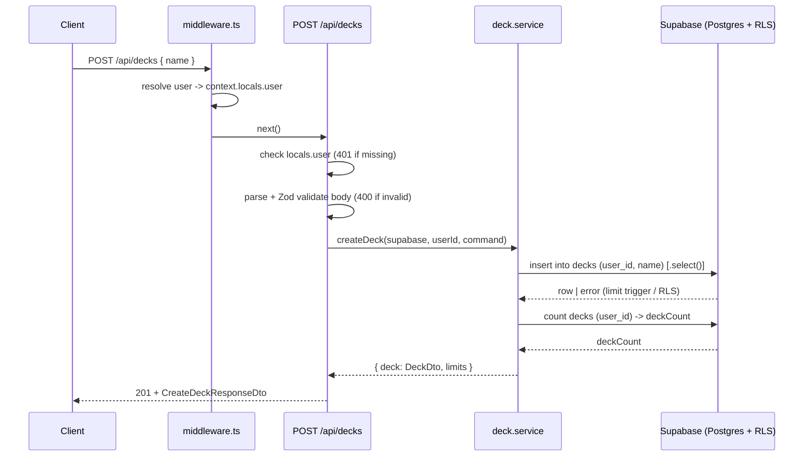

# API Endpoint Implementation Plan: POST /api/decks (Create Deck)

## 1. Endpoint Overview

This endpoint creates a new deck belonging to the authenticated user.
On success it returns a deck representation (`DeckDto`) together with the
current deck limits (`DeckLimitsDto`). The endpoint is server-side rendered
(Astro SSR, Cloudflare Workers) and requires an active Supabase session.

Key business rules:

- `name` is required and must be non-empty after trimming (`length(trim(name)) > 0`).
- Deck names are **not** required to be unique per user.
- A user may own at most **120** decks — the limit is enforced in the database
  by the `enforce_deck_limit()` trigger.
- `user_id` is always derived from the session (`auth.uid()`), never from the
  request body.
- A newly created deck has `flashcardsCount = 0` and `dueFlashcardsCount = 0`.

## 2. Request Details

- **HTTP Method:** `POST`
- **URL:** `/api/decks`
- **Headers:**
  - `Content-Type: application/json` (required)
  - Supabase session cookies (required for authentication)
- **Parameters:**
  - Required: none (no path or query parameters)
  - Optional: none
- **Request Body** (JSON):

  ```json
  {
    "name": "Biology 101"
  }
  ```

  - `name` — `string`, required, non-empty after `trim()`. A recommended
    server-side maximum length (e.g. 100 characters) prevents abuse; it is the
    only accepted key.
  - Unknown fields in the request body must be rejected (Zod `strict` schema)
    to prevent writes to protected fields.

## 3. Types Used

All types are sourced from [src/types.ts](src/types.ts):

- `CreateDeckCommand` — `Pick<DeckRow, "name">` — input model (request body).
- `DeckDto` — deck representation returned in the response (includes computed
  fields `flashcardsCount`, `dueFlashcardsCount`).
- `DeckLimitsDto` — `{ deckCount, deckLimit, canCreateDeck }`.
- `CreateDeckResponseDto` — `{ deck: DeckDto, limits: DeckLimitsDto }`.
- `ApiErrorDto` — consistent error envelope `{ error: { code, message, details? } }`.

Additionally (new, to be created in the service layer):

- Zod validation schema `createDeckSchema` (e.g. in `src/lib/validation/decks.ts`).
- Service function signatures in `src/lib/services/deck.service.ts`.

## 4. Response Details

- **201 Created** — deck created:

  ```json
  {
    "deck": {
      "id": "uuid",
      "name": "Biology 101",
      "createdAt": "2026-06-12T10:00:00.000Z",
      "updatedAt": "2026-06-12T10:00:00.000Z",
      "flashcardsCount": 0,
      "dueFlashcardsCount": 0
    },
    "limits": {
      "deckCount": 5,
      "deckLimit": 120,
      "canCreateDeck": true
    }
  }
  ```

- **Status codes:**
  - `201 Created` — success.
  - `400 Bad Request` — `INVALID_DECK_NAME` / `INVALID_BODY`.
  - `401 Unauthorized` — `AUTH_REQUIRED`.
  - `409 Conflict` — `DECK_LIMIT_REACHED`.
  - `500 Internal Server Error` — `DECK_CREATE_FAILED` / `CONFIG_ERROR`.

All error responses use the `ApiErrorDto` envelope.

## 5. Data Flow



Details:

1. `middleware.ts` creates the Supabase SSR client and sets `context.locals.user`.
2. The route handler reads `context.locals.user`; missing user → `401`.
3. The body is parsed as JSON and validated by `createDeckSchema` (`trim`,
   `min(1)`, `max(...)`, `strict`).
4. The service executes an `INSERT` on `decks` with `user_id = userId` and `name`.
   RLS and the `enforce_deck_limit()` trigger act as the last line of defence.
5. `INSERT` uses `.select()` to return the created row immediately; the new deck
   has `flashcardsCount`/`dueFlashcardsCount = 0` (no extra queries needed).
6. The service fetches the current deck count (`count`) to build `DeckLimitsDto`
   (`deckLimit = 120`, `canCreateDeck = deckCount < 120`).
7. The handler returns `201` with `CreateDeckResponseDto`.

## 6. Security Considerations

- **Authentication:** an active Supabase session is required. The handler checks
  `context.locals.user`; if absent it returns `401 AUTH_REQUIRED`. Do not rely
  solely on `PROTECTED_ROUTES` in middleware — `/api/decks` must verify the user
  itself.
- **Authorization:** `user_id` is set exclusively from `auth.uid()` / the session;
  the client never supplies `userId`. RLS (`decks: authenticated can insert own`)
  enforces `user_id = auth.uid()`.
- **Input validation (Zod):** `strict` schema rejecting unknown fields, `trim`,
  `min(1)`, a reasonable `max`. Content is plain text only.
- **CSRF:** for cookie-authenticated mutations, require same-origin requests —
  validate `Origin`/`Referer` against the allowed host before performing writes.
- **Body size limit:** reject unusually large payloads (application-level JSON
  limit + Cloudflare limits).
- **Resource enumeration:** not applicable to creation, but errors must not leak
  internal details (map database exceptions to generic codes).
- **No sensitive data logging:** do not log full request bodies in persistent logs.

## 7. Error Handling

| Scenario                                                | Code | `error.code`         | Description                                                 |
| ------------------------------------------------------- | ---- | -------------------- | ----------------------------------------------------------- |
| Supabase not configured (`createClient` returns `null`) | 500  | `CONFIG_ERROR`       | Missing `SUPABASE_URL`/`SUPABASE_KEY`.                      |
| No session / unauthenticated                            | 401  | `AUTH_REQUIRED`      | `context.locals.user` is `null`.                            |
| Body is not valid JSON                                  | 400  | `INVALID_BODY`       | `request.json()` parse error.                               |
| `name` empty after `trim()` / missing / wrong type      | 400  | `INVALID_DECK_NAME`  | Zod validation failed; `details` contains field errors.     |
| Unknown fields in body                                  | 400  | `INVALID_BODY`       | `strict` schema rejects extra keys.                         |
| 120-deck limit reached                                  | 409  | `DECK_LIMIT_REACHED` | `enforce_deck_limit()` trigger exception caught and mapped. |
| Other write / RLS error                                 | 500  | `DECK_CREATE_FAILED` | Unexpected Supabase error.                                  |

Handling rules:

- Detect the limit trigger exception by its message text (`Deck limit reached`)
  and map it to `409 DECK_LIMIT_REACHED`, not `500`.
- Return all errors in the `ApiErrorDto` envelope; log technical details
  server-side (`console.error`) without exposing them to the client.
- The project has no dedicated error table — errors are not persisted in the
  database (per `db.md`), only logged at runtime.

## 8. Performance Considerations

- `INSERT ... select()` returns the created row in a single round-trip.
- The deck count query uses the `idx_decks_user_id_created_at` index;
  using `head: true` and `count: "exact"` (scoped to `user_id`) minimises data
  transfer.
- The new deck's counters (`flashcardsCount`, `dueFlashcardsCount`) are
  constant `0`, so no additional aggregations are needed.
- The endpoint is cheap; the main overhead is two queries (insert + count).
  These could be reduced to one via an RPC, but two queries are acceptable
  for MVP.
- Enforce `prerender = false` so the route runs in SSR mode.

## 9. Implementation Steps

1. **Validation:** create `src/lib/validation/decks.ts` with the Zod schema
   `createDeckSchema` (`z.object({ name: z.string().trim().min(1).max(100) }).strict()`).
2. **Service:** create `src/lib/services/deck.service.ts` with a
   `createDeck(supabase, userId, command): Promise<CreateDeckResponseDto>` function:
   - `INSERT` into `decks` with `.select()`,
   - build `DeckLimitsDto` (count + `deckLimit = 120` + `canCreateDeck`),
   - map `DeckRow` → `DeckDto` (camelCase, counters `0`).
3. **Error mapper:** add a helper that returns `ApiErrorDto` and recognises the
   deck-limit trigger exception (`DECK_LIMIT_REACHED`). Consider a shared helper
   `src/lib/api/responses.ts` (`jsonError`, `jsonOk`).
4. **Route handler:** create `src/pages/api/decks.ts`:
   - `export const prerender = false;`
   - `export const POST: APIRoute = async (context) => { ... }`,
   - check `context.locals.user` (→ `401`),
   - create client via `createClient` (→ `500 CONFIG_ERROR` if `null`),
   - (optional) validate `Origin`/`Referer`,
   - parse + validate body (→ `400`),
   - call `createDeck(...)`,
   - return `201` with `CreateDeckResponseDto`.
5. **Types:** confirm alignment with `CreateDeckCommand` / `CreateDeckResponseDto`
   in [src/types.ts](src/types.ts); export additional types if needed.
6. **Security:** ensure `user_id` comes only from the session and the Zod schema
   is `strict`.
7. **Lint/format:** run `npm run lint` and `npm run format` per the pre-commit rules.
8. **Manual testing:** verify scenarios: successful creation (201), empty name
   (400), missing session (401), 120-deck limit exceeded (409).
