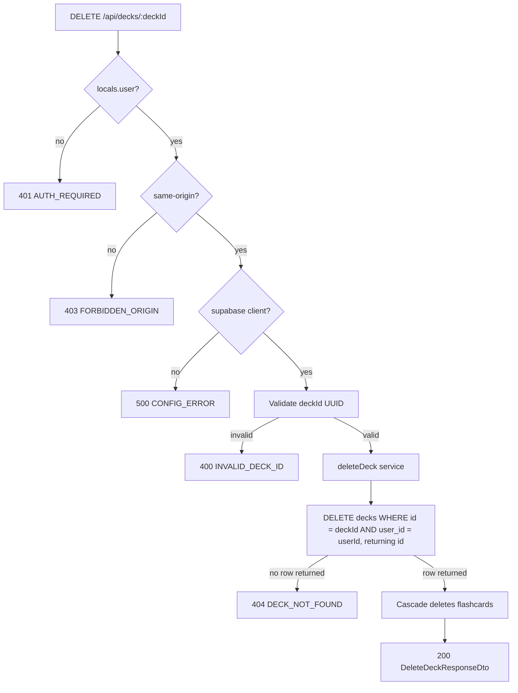

# API Endpoint Implementation Plan: DELETE /api/decks/{deckId} (Delete Deck)

## 1. Endpoint Overview

This endpoint physically deletes a single deck owned by the authenticated user.
Deleting a deck cascades to all of its flashcards (`ON DELETE CASCADE` on
`flashcards.deck_id`). On success it returns a simple confirmation message
(`DeleteDeckResponseDto`). Soft deletion, restore, and undo are out of scope for
the MVP.

The endpoint is server-side rendered (Astro SSR on Cloudflare Workers), requires
an active Supabase session, and lives in a new dynamic route file
`src/pages/api/decks/[deckId].ts` alongside the existing collection route
[src/pages/api/decks.ts](src/pages/api/decks.ts). It shares the service module
[src/lib/services/deck.service.ts](src/lib/services/deck.service.ts).

Key business rules:

- Only a deck where `user_id = auth.uid()` can be deleted (enforced by RLS and
  the explicit session boundary in the route).
- A non-existent deck **or** a deck owned by another user both return
  `404 DECK_NOT_FOUND` (no `403`) to prevent resource enumeration.
- `deckId` must be a valid UUID.
- This is a mutation, so the same-origin (CSRF) check used by `POST` applies.

## 2. Request Details

- **HTTP Method:** `DELETE`
- **URL:** `/api/decks/{deckId}`
- **Headers:**
  - Supabase session cookies (required for authentication)
  - `Origin` is validated for same-origin CSRF protection (cross-origin → 403).
- **Parameters:**
  - **Required:**
    - `deckId` (path) — UUID of the deck to delete.
  - **Optional:** none
- **Request Body:** none.

## 3. Types Used

All types are sourced from [src/types.ts](src/types.ts):

- `DeleteDeckResponseDto` — `MessageResponseDto` (`{ message: string }`).
- `ApiErrorDto` — consistent error envelope `{ error: { code, message, details? } }`.

New artifacts to be created:

- `deckIdParamSchema` — Zod schema in
  [src/lib/validation/decks.ts](src/lib/validation/decks.ts) validating the
  `deckId` path parameter as a UUID.
- `deleteDeck(...)` — service function in
  [src/lib/services/deck.service.ts](src/lib/services/deck.service.ts).

## 4. Response Details

- **200 OK** — `DeleteDeckResponseDto`:

  ```json
  {
    "message": "Deck deleted successfully"
  }
  ```

- **Error responses** use the shared `ApiErrorDto` envelope via `jsonError(...)`
  from [src/lib/api/responses.ts](src/lib/api/responses.ts).

| Status | Code                 | Condition                                        |
| ------ | -------------------- | ------------------------------------------------ |
| 400    | `INVALID_DECK_ID`    | `deckId` path parameter is not a UUID.           |
| 401    | `AUTH_REQUIRED`      | No active session.                               |
| 403    | `FORBIDDEN_ORIGIN`   | Cross-origin cookie-authenticated request.       |
| 404    | `DECK_NOT_FOUND`     | Deck does not exist or is not owned by the user. |
| 500    | `CONFIG_ERROR`       | Supabase client not configured.                  |
| 500    | `DECK_DELETE_FAILED` | Unexpected persistence failure.                  |

## 5. Data Flow



Service responsibilities (`deleteDeck(supabase, userId, deckId)`):

1. Issue a single delete: `.from("decks").delete().eq("id", deckId)
.eq("user_id", userId).select("id")`. The explicit `user_id` filter plus RLS
   guarantees a user can only delete their own deck.
2. Inspect the returned rows. If the deleted set is empty, the deck either does
   not exist or is not owned by the user → throw
   `DeckServiceError("DECK_NOT_FOUND", ...)`.
3. On any other Supabase error → throw
   `DeckServiceError("DECK_DELETE_FAILED", ...)` with the original error as
   `cause`.
4. Return nothing meaningful; the route builds the `DeleteDeckResponseDto`
   message. The database cascade removes the deck's flashcards automatically; no
   separate flashcard delete is required.

## 6. Security Considerations

- **Authentication:** Reject requests without `context.locals.user` with
  `401 AUTH_REQUIRED`, mirroring the existing `POST` handler. Do not rely on
  middleware alone.
- **Authorization:** The delete query filters by the session `user.id`; never
  accept a `userId` from the client. Supabase RLS provides defense in depth.
- **CSRF:** Reuse the `isSameOrigin(request)` check from the existing route for
  this state-changing method; reject cross-origin requests with
  `403 FORBIDDEN_ORIGIN`.
- **Resource enumeration:** Return `404 DECK_NOT_FOUND` (not `403`) for decks
  that do not belong to the requester so existence cannot be probed.
- **Input validation:** Validate `deckId` as a UUID with Zod before querying to
  avoid malformed lookups and to short-circuit with `400 INVALID_DECK_ID`.
- **Parameterized queries only:** Use the Supabase query builder (`.eq`,
  `.delete`); never build SQL from raw input.
- **Idempotency note:** A repeated delete of an already-deleted deck returns
  `404`. This is acceptable and avoids masking missing-resource conditions.

## 7. Performance Considerations

- The delete targets the `decks` primary key (`id`) plus a `user_id` equality
  filter, so it is a single indexed row operation.
- Cascade deletion of flashcards is handled by the database; the
  `flashcards.deck_id` foreign key benefits from the `flashcards(deck_id, ...)`
  indexes. For decks with very large card counts the cascade is the dominant
  cost but remains a single transactional statement.
- Use `.select("id")` on the delete so the affected-row check needs no extra
  round-trip.

## 8. Implementation Steps

1. **Add the path-parameter schema** in
   [src/lib/validation/decks.ts](src/lib/validation/decks.ts):
   - `export const deckIdParamSchema = z.object({ deckId: z.string().uuid("deckId must be a valid UUID.") });`
   - Export `type DeckIdParam = z.infer<typeof deckIdParamSchema>` (optional).

2. **Extend the deck service** in
   [src/lib/services/deck.service.ts](src/lib/services/deck.service.ts):
   - Add `"DECK_NOT_FOUND"` and `"DECK_DELETE_FAILED"` to `DeckServiceErrorCode`.
   - Implement `deleteDeck(supabase, userId, deckId): Promise<void>` following
     the data-flow steps (single delete with `user_id` filter, empty-result →
     `DECK_NOT_FOUND`, other errors → `DECK_DELETE_FAILED`).

3. **Create the dynamic route** `src/pages/api/decks/[deckId].ts`:
   - `export const prerender = false;`
   - Reuse/extract the `isSameOrigin(request)` helper (move it to a shared
     module such as `src/lib/api/csrf.ts` if it should be shared with
     [src/pages/api/decks.ts](src/pages/api/decks.ts), otherwise duplicate it).
   - `export const DELETE: APIRoute = async (context) => { ... }`:
     1. Require `context.locals.user` → `401 AUTH_REQUIRED`.
     2. `isSameOrigin(context.request)` → `403 FORBIDDEN_ORIGIN`.
     3. Create the Supabase client → `500 CONFIG_ERROR` when missing.
     4. Validate `context.params.deckId` with `deckIdParamSchema` →
        `400 INVALID_DECK_ID` on failure.
     5. Call `deleteDeck(...)`; map `DeckServiceError` codes
        (`DECK_NOT_FOUND` → 404, `DECK_DELETE_FAILED` → 500) and any unexpected
        error → `500 DECK_DELETE_FAILED`.
     6. Return `jsonOk({ message: "Deck deleted successfully" }, 200)`.

4. **Add tests** in `src/pages/api/decks/[deckId].test.ts` and extend
   [src/lib/services/deck.service.test.ts](src/lib/services/deck.service.test.ts):
   - 401 when unauthenticated.
   - 403 for cross-origin request.
   - 400 for a non-UUID `deckId`.
   - 404 when the deck does not exist or belongs to another user.
   - 200 with the success message on a valid owned deck, and verification that
     associated flashcards are cascade-deleted.
   - 500 mapping when the underlying delete fails.

5. **Validate** with `npm run lint` and `npm run build`; manually exercise the
   endpoint with an authenticated session cookie to confirm deletion and the
   404 path for a foreign/non-existent `deckId`.
