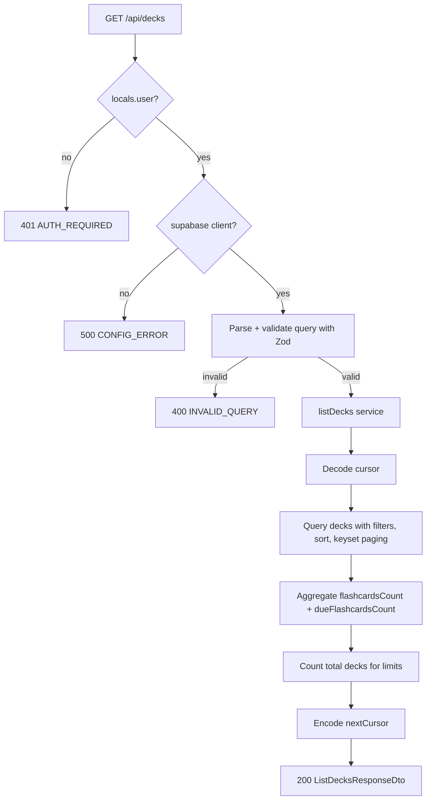

# API Endpoint Implementation Plan: GET /api/decks (List Decks)

## 1. Endpoint Overview

This endpoint returns a paginated, sortable, and searchable list of decks owned
by the authenticated user. Each item is a `DeckDto` enriched with two computed
aggregate counters (`flashcardsCount`, `dueFlashcardsCount`). The response also
includes cursor-based `pagination` metadata and the user's current deck `limits`
(`DeckLimitsDto`).

The endpoint is server-side rendered (Astro SSR on Cloudflare Workers) and
requires an active Supabase session. It is the read counterpart to the already
implemented `POST /api/decks` and shares the same route file
([src/pages/api/decks.ts](src/pages/api/decks.ts)) and service module
([src/lib/services/deck.service.ts](src/lib/services/deck.service.ts)).

Key business rules:

- Only decks where `user_id = auth.uid()` are returned (enforced by RLS and the
  explicit session boundary in the route).
- `limit` defaults to `20` and is capped at `100`.
- Sorting is restricted to a whitelist (`createdAt`, `updatedAt`, `name`);
  default `createdAt` `desc`.
- `search` performs a case-insensitive match on `name`.
- Cursors are opaque, encoded server-side, and scoped to the active query shape
  to prevent tampering and enumeration.

## 2. Request Details

- **HTTP Method:** `GET`
- **URL:** `/api/decks`
- **Headers:**
  - Supabase session cookies (required for authentication)
- **Parameters:**
  - **Required:** none
  - **Optional (query string):**
    - `limit` — integer, default `20`, min `1`, max `100`.
    - `cursor` — opaque string returned in a previous response's
      `pagination.nextCursor`.
    - `sort` — enum: `createdAt` | `updatedAt` | `name`. Default `createdAt`.
    - `order` — enum: `asc` | `desc`. Default `desc`.
    - `search` — string, trimmed; case-insensitive deck-name filter.
- **Request Body:** none (GET request).

Unknown query parameters are ignored (not an error), but every recognized
parameter must pass validation; an invalid value yields `400 INVALID_QUERY`.

## 3. Types Used

All DTOs are sourced from [src/types.ts](src/types.ts):

- `ListDecksQuery` — input model for the parsed query string
  (`extends PaginationQuery` with `sort`, `order`, `search`).
- `DeckDto` — single deck representation (with computed
  `flashcardsCount`, `dueFlashcardsCount`).
- `DeckLimitsDto` — `{ deckCount, deckLimit, canCreateDeck }`.
- `PaginationDto` — `{ nextCursor, hasMore }`.
- `ListDecksResponseDto` — `{ data: DeckDto[], pagination, limits }`.
- `ApiErrorDto` — consistent error envelope `{ error: { code, message, details? } }`.

New artifacts to be created:

- `listDecksQuerySchema` — Zod schema in
  [src/lib/validation/decks.ts](src/lib/validation/decks.ts) that coerces and
  validates query parameters into a `ListDecksQuery`.
- `listDecks(...)` — service function in
  [src/lib/services/deck.service.ts](src/lib/services/deck.service.ts).
- Internal cursor encode/decode helpers (module-private to the service).

## 4. Response Details

- **200 OK** — `ListDecksResponseDto`:

  ```json
  {
    "data": [
      {
        "id": "uuid",
        "name": "Biology 101",
        "createdAt": "2026-06-12T09:46:21.000Z",
        "updatedAt": "2026-06-12T09:46:21.000Z",
        "flashcardsCount": 42,
        "dueFlashcardsCount": 7
      }
    ],
    "pagination": {
      "nextCursor": "b3BhcXVlLWN1cnNvcg==",
      "hasMore": true
    },
    "limits": {
      "deckCount": 12,
      "deckLimit": 120,
      "canCreateDeck": true
    }
  }
  ```

- **Error responses** use the shared `ApiErrorDto` envelope via
  `jsonError(...)` from [src/lib/api/responses.ts](src/lib/api/responses.ts).

| Status | Code           | Condition                                        |
| ------ | -------------- | ------------------------------------------------ |
| 400    | `INVALID_QUERY` | Bad `limit`, `cursor`, `sort`, `order`, `search`. |
| 401    | `AUTH_REQUIRED` | No active session.                               |
| 500    | `CONFIG_ERROR`  | Supabase client not configured.                  |
| 500    | `DECK_LIST_FAILED` | Unexpected query/count failure.               |

## 5. Data Flow



Service responsibilities (`listDecks(supabase, userId, query)`):

1. **Decode cursor** (if present) into the keyset anchor (sort value + `id`
   tiebreaker). An undecodable/mismatched cursor → `INVALID_QUERY` (mapped to
   400 by the route).
2. **Build the base query** against `decks`, filtered by `user_id = userId`
   (RLS also enforces this), applying `ilike('%search%')` on `name` when
   `search` is provided.
3. **Apply ordering** using the whitelisted `sort` column plus `id` as a stable
   tiebreaker, and the keyset predicate derived from the cursor.
4. **Fetch `limit + 1` rows** to determine `hasMore`; trim the extra row and use
   it to compute `nextCursor`.
5. **Compute counters** for the returned decks. Prefer a single grouped
   aggregate query over `flashcards` (filtered by `deck_id IN (...)` and
   `user_id = userId`) returning per-deck `flashcardsCount` and
   `dueFlashcardsCount` (`due_at <= current_date`), then merge into each
   `DeckDto`. Avoid an N+1 per-deck query.
6. **Count total decks** (`count: "exact", head: true`) for `DeckLimitsDto`,
   reusing the same logic/constant (`DECK_LIMIT`) as the create path.
7. **Map rows** to `DeckDto[]` and return `ListDecksResponseDto`.

## 6. Security Considerations

- **Authentication:** Reject requests without `context.locals.user` with
  `401 AUTH_REQUIRED`, mirroring the existing `POST` handler. Do not rely on
  middleware alone.
- **Authorization:** All queries filter by the session `user.id`; never accept
  a `userId` from the client. Supabase RLS provides defense in depth.
- **Resource enumeration:** Return an empty list (not `403/404`) for a user with
  no decks. Invalid cursors return `400 INVALID_QUERY` rather than leaking
  whether other users' records exist.
- **Input validation:** Validate and coerce all query params with Zod before
  use; cap `limit` at `100`; whitelist `sort`/`order` to prevent SQL/ordering
  injection via column names.
- **Cursor integrity:** Encode cursors server-side (base64 of a JSON anchor) and
  validate the decoded shape; reject cursors whose embedded query shape does not
  match the current request to prevent inconsistent paging.
- **No CSRF token required:** GET is a safe, read-only method; the same-origin
  check used for mutations is not needed here.
- **Parameterized queries only:** Use the Supabase query builder
  (`.eq`, `.ilike`, `.order`, `.lt/.gt`); never build SQL from raw input.

## 7. Performance Considerations

- **Indexes:** Sorting/paging aligns with the recommended composite indexes
  `decks(user_id, created_at)` and `decks(user_id, updated_at)`. For
  `sort=name`, ordering relies on `user_id` filtering plus a `name`/`id` sort;
  add a supporting index if name-sorted lists become hot.
- **Keyset (cursor) pagination** avoids `OFFSET` scans and keeps page latency
  constant as the table grows.
- **Avoid N+1:** Compute `flashcardsCount` / `dueFlashcardsCount` for the page
  in a single aggregate query keyed by `deck_id`, not per deck.
- **Counter transfer:** Use `head: true` with `count: "exact"` for the limits
  count so only the count crosses the wire.
- **Page size cap:** Enforcing `limit <= 100` bounds worst-case response size
  and aggregate cost.

## 8. Implementation Steps

1. **Add the query schema** in
   [src/lib/validation/decks.ts](src/lib/validation/decks.ts):
   - `listDecksQuerySchema = z.strictObject({ ... })` (or a lenient object that
     ignores unknown keys) with:
     - `limit`: `z.coerce.number().int().min(1).max(100).default(20)`,
     - `cursor`: `z.string().optional()`,
     - `sort`: `z.enum(["createdAt", "updatedAt", "name"]).default("createdAt")`,
     - `order`: `z.enum(["asc", "desc"]).default("desc")`,
     - `search`: `z.string().trim().min(1).optional()`.
   - Export `type ListDecksInput = z.infer<typeof listDecksQuerySchema>`.

2. **Add cursor helpers** (module-private) in the deck service:
   - `encodeCursor(anchor)` → base64 JSON of `{ sort, order, value, id }`.
   - `decodeCursor(raw, sort, order)` → validated anchor or throw
     `DeckServiceError("INVALID_QUERY", ...)`.

3. **Extend the deck service** in
   [src/lib/services/deck.service.ts](src/lib/services/deck.service.ts):
   - Add `"DECK_LIST_FAILED"` and `"INVALID_QUERY"` to `DeckServiceErrorCode`.
   - Implement `listDecks(supabase, userId, query): Promise<ListDecksResponseDto>`
     following the data-flow steps above (map `sort` → snake_case column,
     keyset predicate, `limit + 1` fetch, aggregate counters, total count,
     `nextCursor`).

4. **Implement the GET handler** in
   [src/pages/api/decks.ts](src/pages/api/decks.ts):
   - `export const GET: APIRoute = async (context) => { ... }`.
   - Require `context.locals.user` → `401 AUTH_REQUIRED`.
   - Create the Supabase client → `500 CONFIG_ERROR` when missing.
   - Parse `new URL(context.request.url).searchParams` into a plain object and
     validate with `listDecksQuerySchema` → `400 INVALID_QUERY` on failure
     (include `z.treeifyError` in `details`).
   - Call `listDecks(...)`; map `DeckServiceError` codes (`INVALID_QUERY` → 400,
     `DECK_LIST_FAILED` → 500) and return `jsonOk(result, 200)` on success.
   - No same-origin/CSRF check (read-only GET).

5. **Add unit/integration tests** in
   [src/pages/api/decks.test.ts](src/pages/api/decks.test.ts) and
   [src/lib/services/deck.service.test.ts](src/lib/services/deck.service.test.ts):
   - 401 when unauthenticated.
   - 400 for invalid `limit`, `sort`, `order`, malformed `cursor`.
   - Default pagination/sort behavior and `hasMore`/`nextCursor` correctness.
   - `search` filtering (case-insensitive).
   - Correct `flashcardsCount` / `dueFlashcardsCount` aggregation.
   - `limits` payload correctness (`canCreateDeck` boundary at `DECK_LIMIT`).

6. **Validate** with `npm run lint` and `npm run build`; manually exercise the
   endpoint with an authenticated session cookie to confirm pagination and
   counters.
