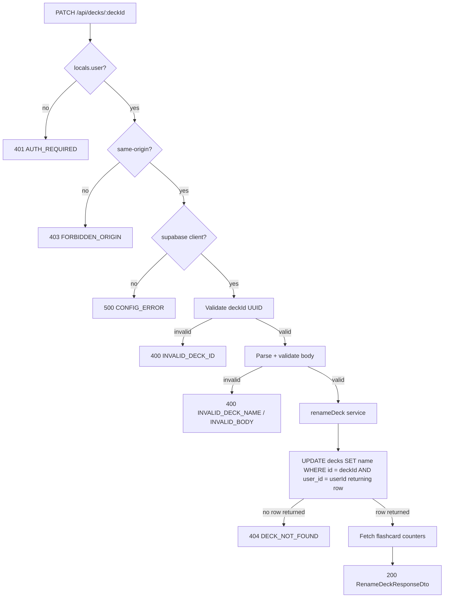

# API Endpoint Implementation Plan: PATCH /api/decks/{deckId} (Rename Deck)

## 1. Endpoint Overview

This endpoint updates the `name` of a single deck owned by the authenticated
user. `name` is the only mutable field; deck names are **not** required to be
unique per user. On success it returns the updated deck representation
(`DeckDto`) with its current computed counters (`flashcardsCount`,
`dueFlashcardsCount`). The `updated_at` column is refreshed automatically by the
`set_updated_at()` trigger.

The endpoint is server-side rendered (Astro SSR on Cloudflare Workers), requires
an active Supabase session, and lives in the dynamic route file
`src/pages/api/decks/[deckId].ts` (shared with `DELETE` and `GET` for a single
deck). It shares the service module
[src/lib/services/deck.service.ts](src/lib/services/deck.service.ts).

Key business rules:

- Only a deck where `user_id = auth.uid()` can be renamed (enforced by RLS and
  the explicit session boundary in the route).
- A non-existent deck **or** a deck owned by another user both return
  `404 DECK_NOT_FOUND` (no `403`) to prevent resource enumeration.
- `deckId` must be a valid UUID; `name` must be non-empty after trimming
  (`length(trim(name)) > 0`) and is capped at the same server-side maximum as
  create (100 characters).
- This is a mutation, so the same-origin (CSRF) check used by `POST`/`DELETE`
  applies.

## 2. Request Details

- **HTTP Method:** `PATCH`
- **URL:** `/api/decks/{deckId}`
- **Headers:**
  - `Content-Type: application/json` (required)
  - Supabase session cookies (required for authentication)
  - `Origin` is validated for same-origin CSRF protection (cross-origin → 403).
- **Parameters:**
  - **Required:**
    - `deckId` (path) — UUID of the deck to rename.
  - **Optional:** none
- **Request Body** (JSON):

  ```json
  {
    "name": "Biology Final Exam"
  }
  ```

  - `name` — `string`, required, non-empty after `trim()`, max 100 characters.
  - Unknown fields are rejected (Zod `strictObject`) so the client can never
    write to server-controlled columns.

## 3. Types Used

All types are sourced from [src/types.ts](src/types.ts):

- `RenameDeckCommand` — `Pick<DeckRow, "name">` — input model (request body).
- `DeckDto` — deck representation returned in the response.
- `RenameDeckResponseDto` — `{ deck: DeckDto }`.
- `ApiErrorDto` — consistent error envelope `{ error: { code, message, details? } }`.

New artifacts to be created:

- `renameDeckSchema` — Zod schema in
  [src/lib/validation/decks.ts](src/lib/validation/decks.ts) for the request
  body (can reuse the same `name` rules as `createDeckSchema`).
- `deckIdParamSchema` — UUID path-parameter schema (shared with the delete/get
  single-deck endpoints; reuse if already added).
- `renameDeck(...)` — service function in
  [src/lib/services/deck.service.ts](src/lib/services/deck.service.ts).

## 4. Response Details

- **200 OK** — `RenameDeckResponseDto`:

  ```json
  {
    "deck": {
      "id": "uuid",
      "name": "Biology Final Exam",
      "createdAt": "2026-06-11T10:00:00.000Z",
      "updatedAt": "2026-06-11T10:05:00.000Z",
      "flashcardsCount": 42,
      "dueFlashcardsCount": 8
    }
  }
  ```

- **Error responses** use the shared `ApiErrorDto` envelope via `jsonError(...)`
  from [src/lib/api/responses.ts](src/lib/api/responses.ts).

| Status | Code                 | Condition                                                  |
| ------ | -------------------- | ---------------------------------------------------------- |
| 400    | `INVALID_DECK_ID`    | `deckId` path parameter is not a UUID.                     |
| 400    | `INVALID_BODY`       | Request body is not valid JSON.                            |
| 400    | `INVALID_DECK_NAME`  | `name` missing, empty after trim, too long, or extra keys. |
| 401    | `AUTH_REQUIRED`      | No active session.                                         |
| 403    | `FORBIDDEN_ORIGIN`   | Cross-origin cookie-authenticated request.                 |
| 404    | `DECK_NOT_FOUND`     | Deck does not exist or is not owned by the user.           |
| 500    | `CONFIG_ERROR`       | Supabase client not configured.                            |
| 500    | `DECK_UPDATE_FAILED` | Unexpected persistence failure.                            |

## 5. Data Flow



Service responsibilities (`renameDeck(supabase, userId, deckId, command)`):

1. Issue a single update:
   `.from("decks").update({ name: command.name }).eq("id", deckId)
.eq("user_id", userId).select("id, name, created_at, updated_at")`.
   The explicit `user_id` filter plus RLS guarantees a user can only rename
   their own deck. `updated_at` is refreshed by the `set_updated_at()` trigger.
2. If the returned set is empty, the deck does not exist or is not owned by the
   user → throw `DeckServiceError("DECK_NOT_FOUND", ...)`.
3. On any other Supabase error → throw
   `DeckServiceError("DECK_UPDATE_FAILED", ...)` with the original error as
   `cause`.
4. Fetch the deck's flashcard counters to build `DeckDto`
   (`flashcardsCount`, `dueFlashcardsCount` where `due_at <= current_date`),
   reusing the same counter logic as the list/get endpoints.
5. Map the row + counters to `DeckDto` and return `RenameDeckResponseDto`.

## 6. Security Considerations

- **Authentication:** Reject requests without `context.locals.user` with
  `401 AUTH_REQUIRED`, mirroring the existing `POST` handler. Do not rely on
  middleware alone.
- **Authorization:** The update query filters by the session `user.id`; never
  accept a `userId` from the client. Supabase RLS provides defense in depth.
- **CSRF:** Reuse the `isSameOrigin(request)` check for this state-changing
  method; reject cross-origin requests with `403 FORBIDDEN_ORIGIN`.
- **Resource enumeration:** Return `404 DECK_NOT_FOUND` (not `403`) for decks
  not owned by the requester.
- **Input validation:** Validate `deckId` as a UUID and `name` with a strict
  Zod schema (trim, non-empty, max length, reject unknown keys) before querying.
- **Field protection:** Only `name` is mutated; `user_id`, `created_at`, and
  SM-2/flashcard data are never touched through this endpoint.
- **Parameterized queries only:** Use the Supabase query builder; never build
  SQL from raw input.

## 7. Performance Considerations

- The update targets the `decks` primary key (`id`) plus a `user_id` equality
  filter — a single indexed row operation.
- Use `.select(...)` on the update so the affected-row check and returned row
  need no extra round-trip.
- The follow-up counter query mirrors the list/get endpoints; compute both
  counters for the single deck in one aggregate query over `flashcards`
  (filtered by `deck_id` and `user_id`) to avoid extra round-trips.

## 8. Implementation Steps

1. **Add validation schemas** in
   [src/lib/validation/decks.ts](src/lib/validation/decks.ts):
   - `renameDeckSchema = z.strictObject({ name: z.string().trim().min(1).max(100) })`
     (reuse the same `name` rules as `createDeckSchema`; consider extracting a
     shared `deckNameSchema`).
   - `deckIdParamSchema = z.object({ deckId: z.string().uuid(...) })` if not
     already present from the delete plan.

2. **Extend the deck service** in
   [src/lib/services/deck.service.ts](src/lib/services/deck.service.ts):
   - Add `"DECK_NOT_FOUND"` and `"DECK_UPDATE_FAILED"` to `DeckServiceErrorCode`
     (reuse `DECK_NOT_FOUND` if already added by the delete plan).
   - Extract a shared counter helper if not present, then implement
     `renameDeck(supabase, userId, deckId, command): Promise<RenameDeckResponseDto>`
     following the data-flow steps.

3. **Add the handler** to the dynamic route `src/pages/api/decks/[deckId].ts`:
   - Reuse the shared `isSameOrigin(request)` helper.
   - `export const PATCH: APIRoute = async (context) => { ... }`:
     1. Require `context.locals.user` → `401 AUTH_REQUIRED`.
     2. `isSameOrigin(context.request)` → `403 FORBIDDEN_ORIGIN`.
     3. Create the Supabase client → `500 CONFIG_ERROR` when missing.
     4. Validate `context.params.deckId` with `deckIdParamSchema` →
        `400 INVALID_DECK_ID`.
     5. Parse JSON body (`400 INVALID_BODY` on parse failure), then validate
        with `renameDeckSchema` → `400 INVALID_DECK_NAME` (include
        `z.treeifyError` in `details`).
     6. Call `renameDeck(...)`; map `DeckServiceError` codes
        (`DECK_NOT_FOUND` → 404, `DECK_UPDATE_FAILED` → 500) and any unexpected
        error → `500 DECK_UPDATE_FAILED`.
     7. Return `jsonOk(result, 200)`.

4. **Add tests** in `src/pages/api/decks/[deckId].test.ts` and extend
   [src/lib/services/deck.service.test.ts](src/lib/services/deck.service.test.ts):
   - 401 when unauthenticated.
   - 403 for cross-origin request.
   - 400 for a non-UUID `deckId`, invalid JSON, empty/too-long `name`, and extra
     keys.
   - 404 when the deck does not exist or belongs to another user.
   - 200 with the updated `DeckDto` (correct `name`, refreshed `updatedAt`,
     correct counters) on a valid owned deck.
   - 500 mapping when the underlying update fails.

5. **Validate** with `npm run lint` and `npm run build`; manually exercise the
   endpoint with an authenticated session cookie to confirm the rename, the
   404 path for a foreign/non-existent `deckId`, and validation errors.
