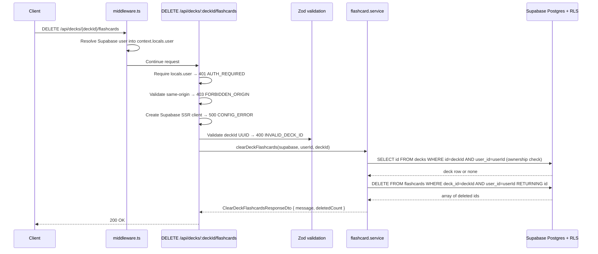

# API Endpoint Implementation Plan: DELETE /api/decks/{deckId}/flashcards (Clear All Flashcards In Deck)

## 1. Endpoint Overview

This endpoint physically deletes all flashcards inside a deck owned by the authenticated user. The deck itself is preserved. It is a bulk destructive operation and cannot be undone.

The endpoint is added as a `DELETE` export to the existing route file `src/pages/api/decks/[deckId]/flashcards.ts`, which already hosts the `POST` handler for creating a manual flashcard. It follows the same pattern: route-level authentication, same-origin CSRF protection, Zod path-parameter validation, a new service-layer function, and shared JSON response helpers. No request body is expected or accepted.

Key business rules:

- `deckId` is required as a path parameter and must be a valid UUID.
- The target deck must exist and belong to the authenticated user. Return `404` for a missing or foreign deck.
- All flashcards in the deck are deleted in a single operation, regardless of `created_by_ai` flag or SM-2 state.
- The response includes `deletedCount` so the client can update state without a follow-up `GET`.
- Deleting from an already-empty deck is valid and returns `200` with `deletedCount: 0` (idempotent).
- `ai_generation_logs` rows referencing this deck are preserved — the schema uses `ON DELETE SET NULL` on `deck_id`.

## 2. Request Details

- **HTTP Method:** `DELETE`
- **URL:** `/api/decks/{deckId}/flashcards`
- **Route file:** `src/pages/api/decks/[deckId]/flashcards.ts` (extend existing file)
- **Headers:**
  - Supabase session cookies are required for authentication.
  - `Origin` is validated for same-origin CSRF protection (consistent with `POST` in the same file).
- **Parameters:**
  - **Required:**
    - `deckId` (path) — UUID of the deck to clear.
  - **Optional:** none.
- **Query parameters:** none.
- **Request body:** None. Any body sent by the client is ignored.

## 3. Types Used

Existing types in `src/types.ts` that are reused:

- `MessageResponseDto` — `{ message: string }` (already used by `DeleteDeckResponseDto` and `DeleteFlashcardResponseDto`).
- `FlashcardRow` — used internally in the service to type delete results.
- `ApiErrorDto` — error envelope.

New type to add in `src/types.ts`:

- `ClearDeckFlashcardsResponseDto`:

  ```ts
  export interface ClearDeckFlashcardsResponseDto {
    message: string;
    deletedCount: number;
  }
  ```

Existing validation artifacts in `src/lib/validation/flashcards.ts` that are reused:

- `deckIdParamSchema` — already validates `{ deckId: UUID }` and is imported by the existing `POST` handler.

No new validation schemas are required; there is no request body to validate.

New service artifact to add in `src/lib/services/flashcard.service.ts`:

- `clearDeckFlashcards(supabase, userId, deckId): Promise<ClearDeckFlashcardsResponseDto>` — verifies deck ownership, deletes all matching rows, and returns `deletedCount`.

The existing `FlashcardServiceErrorCode` union already includes `"DECK_NOT_FOUND"` and `"FLASHCARD_DELETE_FAILED"`, so no changes to the error union or `FlashcardServiceError` class are needed.

## 4. Response Details

### Success Response

- **200 OK** — `ClearDeckFlashcardsResponseDto`:

  ```json
  {
    "message": "All flashcards deleted successfully",
    "deletedCount": 42
  }
  ```

  When the deck is already empty the same shape is returned with `deletedCount: 0`.

### Error Responses

All errors use `jsonError(...)` from `src/lib/api/responses.ts` and the `ApiErrorDto` envelope.

| Status | Error code                | Condition                                                                         |
| ------ | ------------------------- | --------------------------------------------------------------------------------- |
| 400    | `INVALID_DECK_ID`         | `deckId` path parameter is missing or is not a valid UUID.                        |
| 401    | `AUTH_REQUIRED`           | No active authenticated session in `context.locals.user`.                         |
| 403    | `FORBIDDEN_ORIGIN`        | Cookie-authenticated mutation sent from a different origin.                       |
| 404    | `DECK_NOT_FOUND`          | Deck does not exist or is not owned by the authenticated user.                    |
| 500    | `CONFIG_ERROR`            | Supabase client cannot be created due to missing or invalid server configuration. |
| 500    | `FLASHCARD_DELETE_FAILED` | Unexpected persistence or RLS failure during the bulk delete.                     |

## 5. Data Flow



Detailed flow:

1. `middleware.ts` resolves the current Supabase user and stores it in `context.locals.user`.
2. The route checks `context.locals.user`. If missing, return `401 AUTH_REQUIRED` before any further processing.
3. Validate same-origin using the existing `isSameOrigin(request)` helper already defined in the route file.
4. Create the Supabase SSR client with `createClient(context.request.headers, context.cookies)`. If it returns `null`, return `500 CONFIG_ERROR`.
5. Validate `context.params.deckId` with `deckIdParamSchema`. If invalid, return `400 INVALID_DECK_ID`.
6. Call `clearDeckFlashcards(supabase, user.id, params.data.deckId)`.
7. The service first verifies the deck exists and is owned by the user:
   - Query `decks` with `.eq("id", deckId).eq("user_id", userId).select("id").maybeSingle()`.
   - If a query error occurs, throw `FlashcardServiceError("FLASHCARD_DELETE_FAILED", ...)`.
   - If no row is returned, throw `FlashcardServiceError("DECK_NOT_FOUND", ...)`.
   - This explicit check produces the required `404` before attempting the delete and avoids relying on RLS error text.
8. The service deletes all flashcards in the deck:
   - `.from("flashcards").delete().eq("deck_id", deckId).eq("user_id", userId).select("id")`.
   - Double-scoping by `deck_id` and `user_id` is defence-in-depth alongside RLS.
   - If a delete error occurs, throw `FlashcardServiceError("FLASHCARD_DELETE_FAILED", ...)`.
   - `deletedCount = deleted.length` (will be `0` for an empty deck; this is valid).
9. Return `{ message: "All flashcards deleted successfully", deletedCount }`.
10. The route returns `jsonOk(result, 200)`.

## 6. Security Considerations

- **Authentication:** Require `context.locals.user` in the route. Do not rely solely on middleware protection; API routes must enforce authentication directly.
- **Authorization:** The service uses the authenticated `user.id` as the authorization boundary. Deck ownership is verified with `id + user_id` before deleting. Supabase RLS is a second layer of defence. Return `404 DECK_NOT_FOUND` for foreign decks to prevent resource enumeration.
- **No client-controlled scope:** There is no request body. The delete scope is determined entirely by the `deckId` path parameter and the session `userId`.
- **CSRF:** Validate `Origin` for this cookie-authenticated mutation using the `isSameOrigin` helper already present in the route file. Reject mismatched origins with `403 FORBIDDEN_ORIGIN`.
- **Parameterized data access:** Use the Supabase query builder only. Do not construct SQL strings from path parameters.
- **Double-scope delete:** Filter by both `deck_id` and `user_id` in the delete query as defence-in-depth. Even if RLS is misconfigured, this prevents cross-user deletions.
- **Logging:** Do not log flashcard content. On server failures, log only technical error objects with a contextual route tag.
- **ai_generation_logs preservation:** The database schema uses `ON DELETE SET NULL` for `ai_generation_logs.deck_id`, so generation log rows survive the bulk flashcard delete.

## 7. Error Handling

Service error codes used (all pre-existing in `FlashcardServiceErrorCode`):

- `DECK_NOT_FOUND` — target deck is absent or not owned by the user.
- `FLASHCARD_DELETE_FAILED` — deck ownership query or the bulk delete query failed.

Route mapping:

| Service or validation outcome            | HTTP status | API error code            | Response message                          |
| ---------------------------------------- | ----------- | ------------------------- | ----------------------------------------- |
| Missing `context.locals.user`            | 401         | `AUTH_REQUIRED`           | `Authentication is required.`             |
| Mismatched request origin                | 403         | `FORBIDDEN_ORIGIN`        | `Cross-origin requests are not allowed.`  |
| Missing/invalid Supabase config          | 500         | `CONFIG_ERROR`            | `The server is not configured correctly.` |
| Invalid `deckId` path param              | 400         | `INVALID_DECK_ID`         | `Deck id is invalid.`                     |
| Service throws `DECK_NOT_FOUND`          | 404         | `DECK_NOT_FOUND`          | `Deck not found.`                         |
| Service throws `FLASHCARD_DELETE_FAILED` | 500         | `FLASHCARD_DELETE_FAILED` | `Failed to delete flashcards.`            |
| Unexpected thrown error                  | 500         | `FLASHCARD_DELETE_FAILED` | `Failed to delete flashcards.`            |

Additional handling rules:

- Keep all client-facing messages stable and non-technical.
- Use `console.error("[DELETE /api/decks/:deckId/flashcards] ...", error)` for unexpected server errors.
- Do not log flashcard text or deck names in error output.

## 8. Performance Considerations

- The endpoint performs two small database operations: one deck ownership check (primary key lookup) and one bulk delete with `SELECT "id"` returning affected row ids.
- The bulk delete uses the `flashcards(deck_id, created_at)` index for the `deck_id` filter, making it efficient regardless of deck size.
- No aggregate reads, count queries, or extra round-trips are needed. `deletedCount` comes from the length of the `RETURNING id` result set at no extra cost.
- `export const prerender = false` is already set in the route file; no change needed.

## 9. Implementation Steps

1. **Add response type** in `src/types.ts`:
   - Add `ClearDeckFlashcardsResponseDto` interface with `message: string` and `deletedCount: number` after the existing `DeleteFlashcardResponseDto`.

2. **Add service function** in `src/lib/services/flashcard.service.ts`:
   - Add import for `ClearDeckFlashcardsResponseDto` from `@/types`.
   - Implement `clearDeckFlashcards(supabase, userId, deckId): Promise<ClearDeckFlashcardsResponseDto>`:
     - Verify deck ownership: `.from("decks").select("id").eq("id", deckId).eq("user_id", userId).maybeSingle()`.
     - Throw `FlashcardServiceError("FLASHCARD_DELETE_FAILED", ...)` on a query error.
     - Throw `FlashcardServiceError("DECK_NOT_FOUND", ...)` if no deck row returned.
     - Delete flashcards: `.from("flashcards").delete().eq("deck_id", deckId).eq("user_id", userId).select("id")`.
     - Throw `FlashcardServiceError("FLASHCARD_DELETE_FAILED", ...)` on a delete error.
     - Return `{ message: "All flashcards deleted successfully", deletedCount: deleted.length }`.

3. **Add `DELETE` handler** in `src/pages/api/decks/[deckId]/flashcards.ts`:
   - Add `clearDeckFlashcards` to the import from `@/lib/services/flashcard.service`.
   - Add `ClearDeckFlashcardsResponseDto` to the type import from `@/types`.
   - Implement `export const DELETE: APIRoute` with this order:
     1. Require `context.locals.user` → `401 AUTH_REQUIRED`.
     2. Validate same-origin with existing `isSameOrigin` helper → `403 FORBIDDEN_ORIGIN`.
     3. Create Supabase client → `500 CONFIG_ERROR`.
     4. Validate `context.params.deckId` with existing `deckIdParamSchema` → `400 INVALID_DECK_ID`.
     5. Call `clearDeckFlashcards(supabase, user.id, params.data.deckId)`.
     6. Map `DECK_NOT_FOUND` → `404 DECK_NOT_FOUND`.
     7. Map `FLASHCARD_DELETE_FAILED` and unexpected errors → `500 FLASHCARD_DELETE_FAILED`.
     8. Return `jsonOk(result, 200)`.

4. **Add service tests** in `src/lib/services/flashcard.service.test.ts`:
   - Add a `makeSupabaseForClear` helper that mocks:
     - deck check: `.from("decks").select().eq().eq().maybeSingle()`
     - bulk delete: `.from("flashcards").delete().eq().eq().select()`
   - Test: verifies deck ownership before deleting (checks `from("decks")` is called first).
   - Test: returns `deletedCount` equal to the length of the RETURNING array.
   - Test: returns `deletedCount: 0` when the deck is empty (RETURNING returns `[]`).
   - Test: throws `DECK_NOT_FOUND` when the deck check returns `null`; no delete is attempted.
   - Test: throws `FLASHCARD_DELETE_FAILED` when the deck ownership query errors.
   - Test: throws `FLASHCARD_DELETE_FAILED` when the delete query errors.

5. **Add route tests** in `src/pages/api/decks/[deckId]/flashcards.test.ts`:
   - Add `clearDeckFlashcardsMock` alongside the existing `createManualFlashcardMock` in the module mock setup for `@/lib/services/flashcard.service`.
   - Add a `DELETE` describe block with tests for:
     - `401 AUTH_REQUIRED` when no user in context.
     - `403 FORBIDDEN_ORIGIN` for cross-origin requests.
     - `500 CONFIG_ERROR` when `createClient` returns `null`.
     - `400 INVALID_DECK_ID` for a non-UUID `deckId` param.
     - `200 OK` success: response body matches `ClearDeckFlashcardsResponseDto`, service called with `(supabase, userId, deckId)`.
     - `200 OK` with `deletedCount: 0` for an already-empty deck.
     - `404 DECK_NOT_FOUND` when service throws `FlashcardServiceError("DECK_NOT_FOUND", ...)`.
     - `500 FLASHCARD_DELETE_FAILED` when service throws `FlashcardServiceError("FLASHCARD_DELETE_FAILED", ...)`.
     - `500 FLASHCARD_DELETE_FAILED` for an unexpected thrown error.

6. **Validate implementation**:
   - Run focused tests for the updated route and service first.
   - Run `npm run lint` to satisfy type-aware ESLint rules.
   - Run `npm run build` if module changes affect Cloudflare SSR resolution.
