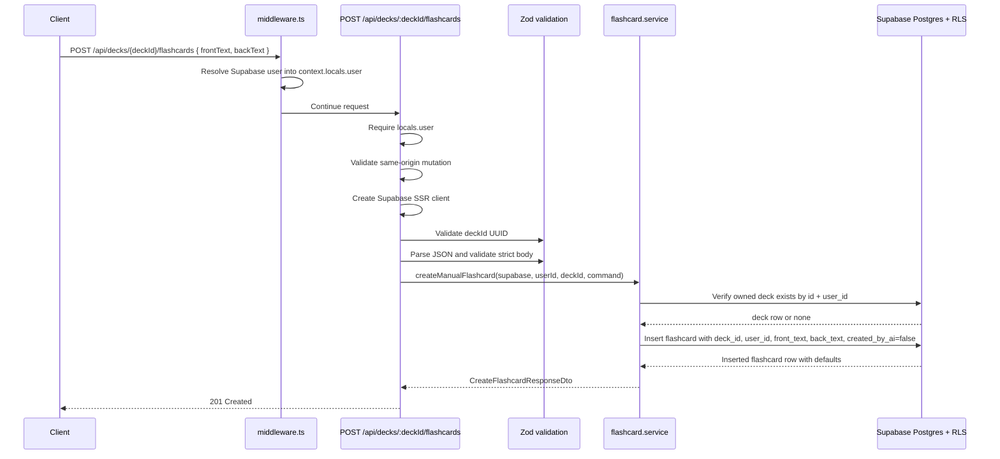

# API Endpoint Implementation Plan: POST /api/decks/{deckId}/flashcards (Create Manual Flashcard)

## 1. Endpoint Overview

This endpoint creates one manual flashcard inside a deck owned by the authenticated user. The flashcard is created with user-supplied plain-text `frontText` and `backText`; all ownership, source, SM-2 scheduling, and timestamp fields are server- or database-controlled.

The endpoint runs as an Astro SSR API route on Cloudflare Workers and uses Supabase Auth, Supabase RLS, and the existing cookie-based Supabase SSR client. It should follow the current API route pattern used by deck endpoints: route-level authentication, same-origin protection for mutations, Zod validation, a service-layer persistence function, and shared JSON response helpers.

Key business rules:

- `deckId` is required as a path parameter and must be a valid UUID.
- The target deck must exist and belong to the authenticated user.
- `frontText` and `backText` are required, trimmed, non-empty plain-text strings.
- `frontText` is capped at 500 characters and should satisfy the MVP short-question heuristic: reject more than two sentence-ending punctuation marks.
- `backText` is capped at 3000 characters.
- Unknown request-body fields must be rejected so clients cannot write `userId`, `createdByAi`, `deckId`, SM-2 fields, or timestamps.
- Manual creation must set `created_by_ai = false` server-side.
- `user_id` must be derived from the session or by the database trigger `set_flashcard_user_id_from_deck()`, never from the request body.
- Initial SM-2 fields come from database defaults: `sm2_interval = 0`, `sm2_repetition = 0`, `sm2_ease_factor = 2.50`, `due_at = current_date`, `last_reviewed_at = null`.

## 2. Request Details

- **HTTP Method:** `POST`
- **URL:** `/api/decks/{deckId}/flashcards`
- **Route file:** `src/pages/api/decks/[deckId]/flashcards.ts`
- **Headers:**
  - `Content-Type: application/json` is required.
  - Supabase session cookies are required for authentication.
  - `Origin` should be validated for same-origin CSRF protection; matching origin or missing `Origin` is allowed, cross-origin requests are rejected.
- **Parameters:**
  - **Required:**
    - `deckId` (path) — UUID of the deck that will receive the new flashcard.
  - **Optional:** none.
- **Query parameters:** none.
- **Request Body:**

  ```json
  {
    "frontText": "What is photosynthesis?",
    "backText": "Photosynthesis is the process by which plants convert light energy into chemical energy stored in glucose."
  }
  ```

Request body field rules:

- `frontText`:
  - Required string.
  - Trim before validation and persistence.
  - Must be non-empty after trimming.
  - Maximum 500 characters.
  - Plain text only; reject HTML-like markup.
  - Must satisfy the short-question rule: reject values with more than two sentence-ending punctuation marks (`.`, `?`, `!`) unless product requirements later soften this into a warning.
- `backText`:
  - Required string.
  - Trim before validation and persistence.
  - Must be non-empty after trimming.
  - Maximum 3000 characters.
  - Plain text only; reject HTML-like markup.
- Unknown fields:
  - Reject using `z.strictObject(...)` to block accidental or malicious writes to server-controlled fields.

## 3. Types Used

All public contract types already exist in `src/types.ts`:

- `CreateFlashcardCommand` — request command model with:
  - `frontText: FlashcardRow["front_text"]`
  - `backText: FlashcardRow["back_text"]`
- `CreateFlashcardResponseDto` — response DTO: `{ flashcard: FlashcardDto }`.
- `FlashcardDto` — public flashcard representation with camelCase fields and nested SM-2 state.
- `Sm2Dto` — nested SM-2 representation inside `FlashcardDto`.
- `FlashcardRow` — database row shape for `public.flashcards`.
- `ApiErrorDto` — shared error envelope: `{ error: { code, message, details? } }`.

New implementation artifacts to add:

- `src/lib/validation/flashcards.ts`:
  - `deckIdParamSchema` or a shared UUID path schema for `{ deckId }`.
  - `createFlashcardSchema` for `CreateFlashcardCommand`.
  - `flashcardTextSchema` or field-specific helpers for text constraints.
  - Exported `CreateFlashcardInput` inferred from the schema.
- `src/lib/services/flashcard.service.ts`:
  - `FlashcardServiceErrorCode` union.
  - `FlashcardServiceError` domain error class.
  - `createManualFlashcard(supabase, userId, deckId, command): Promise<CreateFlashcardResponseDto>`.
  - `toFlashcardDto(row: FlashcardRow): FlashcardDto` mapper.

## 4. Response Details

### Success Response

- **201 Created** — `CreateFlashcardResponseDto`:

  ```json
  {
    "flashcard": {
      "id": "uuid",
      "deckId": "uuid",
      "frontText": "What is photosynthesis?",
      "backText": "Photosynthesis is the process by which plants convert light energy into chemical energy stored in glucose.",
      "createdByAi": false,
      "sm2": {
        "interval": 0,
        "repetition": 0,
        "easeFactor": 2.5,
        "dueAt": "2026-06-16",
        "lastReviewedAt": null
      },
      "createdAt": "2026-06-16T10:00:00.000Z",
      "updatedAt": "2026-06-16T10:00:00.000Z"
    }
  }
  ```

### Error Responses

All errors must use `jsonError(...)` from `src/lib/api/responses.ts` and the `ApiErrorDto` envelope.

| Status | Error code                | Condition                                                                                                                                                                                       |
| ------ | ------------------------- | ----------------------------------------------------------------------------------------------------------------------------------------------------------------------------------------------- |
| 400    | `INVALID_DECK_ID`         | `deckId` is missing or is not a UUID.                                                                                                                                                           |
| 400    | `INVALID_BODY`            | Request body is not valid JSON.                                                                                                                                                                 |
| 400    | `INVALID_FLASHCARD_TEXT`  | `frontText` or `backText` is missing, non-string, empty after trim, too long, contains HTML-like markup, violates the front-text short-question heuristic, or the body contains unknown fields. |
| 401    | `AUTH_REQUIRED`           | No active authenticated session is available in `context.locals.user`.                                                                                                                          |
| 403    | `FORBIDDEN_ORIGIN`        | Cookie-authenticated mutation was sent from a different origin. This follows existing mutation-route behavior even though the public API status-code list focuses on 400/401/404/500.           |
| 404    | `DECK_NOT_FOUND`          | The deck does not exist or is not owned by the authenticated user.                                                                                                                              |
| 500    | `CONFIG_ERROR`            | Supabase client cannot be created because server configuration is missing or invalid.                                                                                                           |
| 500    | `FLASHCARD_CREATE_FAILED` | Unexpected persistence, RLS, trigger, or mapping failure.                                                                                                                                       |

## 5. Data Flow



Detailed flow:

1. `middleware.ts` resolves the current Supabase user and stores it in `context.locals.user`.
2. The route checks `context.locals.user`. If missing, return `401 AUTH_REQUIRED` before parsing the body.
3. Because this endpoint mutates cookie-authenticated state, validate same-origin using the helper pattern already used by deck mutations.
4. Create the Supabase SSR client with `createClient(context.request.headers, context.cookies)`. If it returns `null`, return `500 CONFIG_ERROR`.
5. Validate `context.params.deckId` with a UUID Zod schema. If invalid, return `400 INVALID_DECK_ID`.
6. Parse `context.request.json()`. If parsing throws, return `400 INVALID_BODY`.
7. Validate the parsed body with `createFlashcardSchema`. If validation fails, return `400 INVALID_FLASHCARD_TEXT` with `z.treeifyError(parsed.error)` in `details`.
8. Call `createManualFlashcard(supabase, user.id, deckId, command)`.
9. The service first verifies the deck exists and is owned by the user:
   - Query `decks` with `.eq("id", deckId).eq("user_id", userId).select("id").maybeSingle()`.
   - If no row is returned, throw `FlashcardServiceError("DECK_NOT_FOUND", ...)`.
   - This explicit check produces the required `404` before attempting an insert and avoids relying on foreign-key/RLS error text.
10. The service inserts the row into `flashcards`:
    - Set `deck_id = deckId`.
    - Set `user_id = userId` for clarity and RLS compatibility, while the database trigger remains the authoritative guard that keeps `flashcards.user_id` aligned with the deck owner.
    - Set `front_text = command.frontText` and `back_text = command.backText`.
    - Set `created_by_ai = false`.
    - Do not send SM-2 fields, `created_at`, or `updated_at`; rely on database defaults and triggers.
11. Use `.select("id, user_id, deck_id, front_text, back_text, created_by_ai, sm2_interval, sm2_repetition, sm2_ease_factor, due_at, last_reviewed_at, created_at, updated_at").single()` to return the inserted row.
12. Map `FlashcardRow` to `FlashcardDto`:
    - `deck_id` -> `deckId`
    - `front_text` -> `frontText`
    - `back_text` -> `backText`
    - `created_by_ai` -> `createdByAi`
    - `sm2_*` fields -> nested `sm2`
    - timestamps -> `createdAt`, `updatedAt`
13. Return `jsonOk(result, 201)`.

## 6. Security Considerations

- **Authentication:** Require `context.locals.user` in the route. Do not rely solely on protected page middleware; API routes must enforce authentication directly.
- **Authorization:** The service must use the authenticated `user.id` as the authorization boundary. Check deck ownership with `deck_id + user_id` before inserting. Supabase RLS remains defense in depth.
- **No client-controlled ownership:** Reject unknown fields and never accept `userId`, `user_id`, `deckId` in the body, `createdByAi`, SM-2 fields, or timestamps from the client.
- **CSRF:** Validate `Origin` for this cookie-authenticated mutation. Allow missing `Origin` for tests/server-to-server requests if keeping parity with current deck endpoints; reject mismatched origins with `403 FORBIDDEN_ORIGIN`.
- **Plain text only:** Reject HTML-like markup at validation time and render flashcard content escaped in the UI. Store flashcards as plain text, not HTML.
- **Resource enumeration:** Return `404 DECK_NOT_FOUND` for both missing decks and decks owned by another user. Do not return `403` for foreign decks.
- **Parameterized data access:** Use the Supabase query builder only. Do not construct SQL strings from request input.
- **Request size:** Keep app-level validation strict and rely on Cloudflare body limits. The body should contain only two bounded text fields.
- **Logging:** Do not log request bodies or flashcard text. On server failures, log technical error objects only with contextual route tags. There is no database error-log table in the provided schema, so no error rows should be written.
- **AI data separation:** This endpoint is manual-only. It must not create AI generation logs, consume AI credits, call AI providers, or set `created_by_ai = true`.

## 7. Error Handling

Use a domain error class in the service and map it in the route.

Recommended service error codes:

- `DECK_NOT_FOUND` — target deck is absent or not owned by the user.
- `FLASHCARD_CREATE_FAILED` — insert failed or the inserted row could not be returned.

Route mapping:

| Service or validation outcome            | HTTP status | API error code            | Response message guidance                              |
| ---------------------------------------- | ----------- | ------------------------- | ------------------------------------------------------ |
| Missing `context.locals.user`            | 401         | `AUTH_REQUIRED`           | `Authentication is required to create a flashcard.`    |
| Mismatched request origin                | 403         | `FORBIDDEN_ORIGIN`        | `Cross-origin requests are not allowed.`               |
| Missing/invalid Supabase config          | 500         | `CONFIG_ERROR`            | `The server is not configured correctly.`              |
| Invalid `deckId` path param              | 400         | `INVALID_DECK_ID`         | `Deck id is invalid.`                                  |
| JSON parse failure                       | 400         | `INVALID_BODY`            | `Request body must be valid JSON.`                     |
| Zod body validation failure              | 400         | `INVALID_FLASHCARD_TEXT`  | `Flashcard text is invalid.` Include `details.issues`. |
| Service throws `DECK_NOT_FOUND`          | 404         | `DECK_NOT_FOUND`          | `Deck not found.`                                      |
| Service throws `FLASHCARD_CREATE_FAILED` | 500         | `FLASHCARD_CREATE_FAILED` | `Failed to create flashcard.`                          |
| Unexpected thrown error                  | 500         | `FLASHCARD_CREATE_FAILED` | `Failed to create flashcard.`                          |

Additional handling rules:

- Keep all client-facing messages stable and non-technical.
- Include structured Zod details only for client-fixable validation errors.
- Use `console.error("[POST /api/decks/:deckId/flashcards] ...", error)` for unexpected server errors, but do not log `frontText` or `backText`.
- Do not persist errors to the database because `db.md` defines no error table and explicitly avoids storing AI/provider error details. Manual flashcard validation and persistence failures should remain runtime logs.

## 8. Performance Considerations

- The endpoint performs two small database operations in the normal path: one deck ownership check and one insert returning the inserted row.
- The deck lookup uses the deck primary key and `user_id`. The primary key lookup is selective; RLS and the explicit `user_id` filter keep access scoped.
- The insert benefits from the `flashcards(deck_id, created_at)` and `flashcards(user_id, due_at)` indexes only after insertion; no list or count aggregation is needed for the response.
- Avoid extra reads for deck counters. `CreateFlashcardResponseDto` returns only the created flashcard, not deck metadata.
- Do not perform server-side HTML sanitization with heavy parsers unless the project later chooses to allow rich text. For MVP, reject HTML-like strings using a conservative validator and store plain text.
- Use `.select(...).single()` on insert to avoid a follow-up read.
- Keep `export const prerender = false` so the endpoint is executed per request in the Cloudflare Workers runtime.

## 9. Implementation Steps

1. **Create validation module** in `src/lib/validation/flashcards.ts`:
   - Import `z` from `zod`.
   - Add `deckIdParamSchema = z.object({ deckId: z.uuid("Deck id must be a valid UUID.") })` or extract a shared UUID schema if other flashcard routes will reuse it.
   - Add a helper that rejects HTML-like input, for example strings matching tags such as `<tag>`, closing tags, or script-like markup. Keep the rule conservative and documented in tests.
   - Add a helper for the short-front-text heuristic: count sentence-ending punctuation marks (`.`, `?`, `!`) and reject more than two.
   - Add `frontTextSchema = z.string(...).trim().min(1).max(500).refine(plainText).refine(shortQuestion)`.
   - Add `backTextSchema = z.string(...).trim().min(1).max(3000).refine(plainText)`.
   - Export `createFlashcardSchema = z.strictObject({ frontText: frontTextSchema, backText: backTextSchema })`.
   - Export `CreateFlashcardInput = z.infer<typeof createFlashcardSchema>`.

2. **Create flashcard service** in `src/lib/services/flashcard.service.ts`:
   - Import `SupabaseClient` and types from `src/types.ts`.
   - Define `FlashcardServiceErrorCode = "DECK_NOT_FOUND" | "FLASHCARD_CREATE_FAILED"`.
   - Define `FlashcardServiceError extends Error` with a readonly `code` and optional `cause`.
   - Implement `toFlashcardDto(row: FlashcardRow): FlashcardDto`.
   - Implement `createManualFlashcard(supabase, userId, deckId, command): Promise<CreateFlashcardResponseDto>`.
   - In the service, verify the owned deck exists before inserting.
   - Insert only allowed columns into `flashcards`: `deck_id`, `user_id`, `front_text`, `back_text`, `created_by_ai: false`.
   - Select and return all columns needed for `FlashcardDto`.
   - Throw `DECK_NOT_FOUND` for missing/foreign decks; throw `FLASHCARD_CREATE_FAILED` for any insert/read failure.

3. **Create route handler** in `src/pages/api/decks/[deckId]/flashcards.ts`:
   - `export const prerender = false`.
   - Import `APIRoute`, `z`, `createClient`, `jsonError`, `jsonOk`, validation schemas, service function, service error class, and `CreateFlashcardCommand` / `CreateFlashcardResponseDto`.
   - Add or reuse an `isSameOrigin(request)` helper consistent with existing deck mutation routes.
   - Implement `POST` with this order:
     1. Require `context.locals.user` -> `401 AUTH_REQUIRED`.
     2. Validate same-origin -> `403 FORBIDDEN_ORIGIN`.
     3. Create Supabase client -> `500 CONFIG_ERROR`.
     4. Validate `context.params.deckId` -> `400 INVALID_DECK_ID`.
     5. Parse JSON -> `400 INVALID_BODY`.
     6. Validate body -> `400 INVALID_FLASHCARD_TEXT` with Zod details.
     7. Call `createManualFlashcard(...)`.
     8. Map `DECK_NOT_FOUND` -> `404 DECK_NOT_FOUND`.
     9. Map service and unexpected failures -> `500 FLASHCARD_CREATE_FAILED`.
     10. Return `jsonOk(result, 201)`.

4. **Add route tests** in `src/pages/api/decks/[deckId]/flashcards.test.ts`:
   - Mock `@/lib/supabase` because it depends on `astro:env/server`.
   - Mock `createManualFlashcard` while preserving the real `FlashcardServiceError` class for `instanceof` checks.
   - Test success: returns `201`, response matches `CreateFlashcardResponseDto`, and service is called with `(supabase, userId, deckId, { frontText, backText })` using trimmed values.
   - Test `401 AUTH_REQUIRED` when no user exists.
   - Test `403 FORBIDDEN_ORIGIN` for cross-origin requests and success for same-origin requests.
   - Test `500 CONFIG_ERROR` when `createClient` returns `null`.
   - Test `400 INVALID_DECK_ID` for a non-UUID path param.
   - Test `400 INVALID_BODY` for malformed JSON.
   - Test `400 INVALID_FLASHCARD_TEXT` for missing fields, empty strings, overly long `frontText`, overly long `backText`, HTML-like input, too many sentence-ending punctuation marks in `frontText`, and unknown fields.
   - Test `404 DECK_NOT_FOUND` when the service throws `FlashcardServiceError("DECK_NOT_FOUND", ...)`.
   - Test `500 FLASHCARD_CREATE_FAILED` for service and unexpected errors.

5. **Add service tests** in `src/lib/services/flashcard.service.test.ts`:
   - Verify the service checks deck ownership before inserting.
   - Verify a missing/foreign deck maps to `DECK_NOT_FOUND` and no insert occurs.
   - Verify a successful insert uses only allowed columns and maps snake_case DB fields to `FlashcardDto` correctly.
   - Verify insert errors map to `FLASHCARD_CREATE_FAILED`.
   - Verify DB defaults are preserved in the returned DTO rather than recomputed in application code.

6. **Confirm database assumptions**:
   - Ensure `supabase/migrations/20260611000000_initial_schema.sql` includes RLS for `flashcards`, the `set_flashcard_user_id_from_deck()` trigger, and constraints for non-empty text and max lengths.
   - If the database currently lacks the front/back maximum length constraints from `db.md`, keep them enforced in Zod and add a separate migration task rather than silently relying only on app validation.

7. **Validate implementation**:
   - Run focused tests for the new route and service first.
   - Run `npm run lint` to satisfy type-aware ESLint rules.
   - Run `npm run build` if route/module resolution or Cloudflare SSR behavior changed.
   - Optionally test manually with an authenticated session cookie:
     - Valid request -> `201`.
     - Invalid `deckId` -> `400`.
     - Foreign or missing deck -> `404`.
     - Invalid text -> `400`.
     - Missing session -> `401`.
