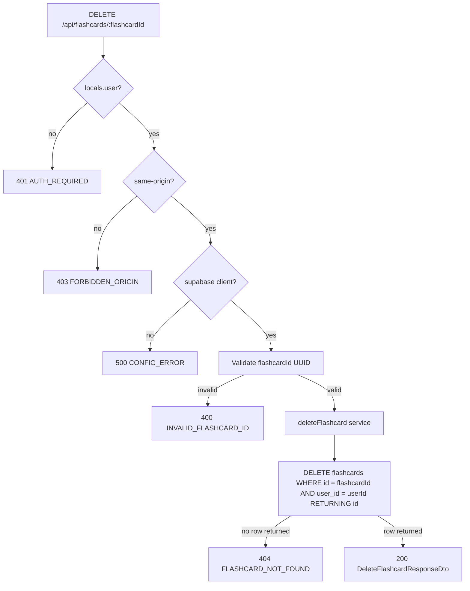

# API Endpoint Implementation Plan: DELETE /api/flashcards/{flashcardId} (Delete Flashcard)

## 1. Endpoint Overview

This endpoint physically deletes one flashcard owned by the authenticated user. It returns a simple confirmation message (`DeleteFlashcardResponseDto`) on success. Soft deletion, restore, undo, audit logs, and review-history preservation are out of scope for the MVP.

The endpoint runs as an Astro SSR API route on Cloudflare Workers and uses Supabase Auth, Supabase RLS, and the existing cookie-based Supabase SSR client. It should follow the established mutation-route pattern used by deck endpoints: route-level authentication, same-origin protection, Zod validation for path parameters, service-layer persistence, and shared JSON response helpers.

Key business rules:

- `flashcardId` is required as a path parameter and must be a valid UUID.
- Only a flashcard where `user_id = auth.uid()` can be deleted.
- A non-existent flashcard and a flashcard owned by another user both return `404 FLASHCARD_NOT_FOUND` to prevent resource enumeration.
- Deletion is physical and permanent for the MVP.
- Deleting a flashcard must not affect its parent deck, other flashcards, AI generation logs, AI credits, or user profile data.
- This is a cookie-authenticated mutation, so same-origin CSRF protection applies.

## 2. Request Details

- **HTTP Method:** `DELETE`
- **URL:** `/api/flashcards/{flashcardId}`
- **Route file:** `src/pages/api/flashcards/[flashcardId].ts`
- **Headers:**
  - Supabase session cookies are required for authentication.
  - `Origin` should be validated for same-origin CSRF protection; matching origin or missing `Origin` is allowed, cross-origin requests are rejected.
- **Parameters:**
  - **Required:**
    - `flashcardId` (path) — UUID of the flashcard to delete.
  - **Optional:** none.
- **Query parameters:** none.
- **Request Body:** none. The handler should not parse or require JSON for this endpoint.

## 3. Types Used

All public contract types already exist in `src/types.ts`:

- `DeleteFlashcardResponseDto` — alias of `MessageResponseDto`, response shape `{ message: string }`.
- `MessageResponseDto` — generic success message DTO.
- `ApiErrorDto` — shared error envelope: `{ error: { code, message, details? } }`.
- `FlashcardRow` — database row shape for `public.flashcards`; used by the service only for table/column alignment.

New implementation artifacts to add or extend:

- `src/lib/validation/flashcards.ts`:
  - `flashcardIdParamSchema` for `{ flashcardId }` UUID validation.
- `src/lib/services/flashcard.service.ts`:
  - Extend `FlashcardServiceErrorCode` with `FLASHCARD_NOT_FOUND` and `FLASHCARD_DELETE_FAILED`.
  - Reuse or create `FlashcardServiceError`.
  - Add `deleteFlashcard(supabase, userId, flashcardId): Promise<void>`.

## 4. Response Details

### Success Response

- **200 OK** — `DeleteFlashcardResponseDto`:

  ```json
  {
    "message": "Flashcard deleted successfully"
  }
  ```

### Error Responses

All errors must use `jsonError(...)` from `src/lib/api/responses.ts` and the `ApiErrorDto` envelope.

| Status | Error code                | Condition                                                                                                      |
| ------ | ------------------------- | -------------------------------------------------------------------------------------------------------------- |
| 400    | `INVALID_FLASHCARD_ID`    | `flashcardId` is missing or is not a UUID.                                                                     |
| 401    | `AUTH_REQUIRED`           | No active authenticated session is available in `context.locals.user`.                                         |
| 403    | `FORBIDDEN_ORIGIN`        | Cookie-authenticated mutation was sent from a different origin. This follows existing mutation-route behavior. |
| 404    | `FLASHCARD_NOT_FOUND`     | The flashcard does not exist or is not owned by the authenticated user.                                        |
| 500    | `CONFIG_ERROR`            | Supabase client cannot be created because server configuration is missing or invalid.                          |
| 500    | `FLASHCARD_DELETE_FAILED` | Unexpected persistence, RLS, or database failure.                                                              |

## 5. Data Flow



Detailed flow:

1. `middleware.ts` resolves the current Supabase user and stores it in `context.locals.user`.
2. The route checks `context.locals.user`. If missing, return `401 AUTH_REQUIRED`.
3. Because this endpoint mutates cookie-authenticated state, validate same-origin using the helper pattern already used by deck mutations.
4. Create the Supabase SSR client with `createClient(context.request.headers, context.cookies)`. If it returns `null`, return `500 CONFIG_ERROR`.
5. Validate `context.params.flashcardId` with a UUID Zod schema. If invalid, return `400 INVALID_FLASHCARD_ID` with structured Zod details.
6. Call `deleteFlashcard(supabase, user.id, flashcardId)`.
7. The service issues a single scoped delete:
   - `.from("flashcards")`
   - `.delete()`
   - `.eq("id", flashcardId)`
   - `.eq("user_id", userId)`
   - `.select("id")`
8. If Supabase returns an error, throw `FlashcardServiceError("FLASHCARD_DELETE_FAILED", ...)` with the original error as `cause`.
9. If the returned deleted-row array is empty, throw `FlashcardServiceError("FLASHCARD_NOT_FOUND", ...)`.
10. If a row was deleted, the service resolves without returning data.
11. The route returns `jsonOk({ message: "Flashcard deleted successfully" }, 200)`.

## 6. Security Considerations

- **Authentication:** Require `context.locals.user` in the route. Do not rely solely on middleware or protected UI routes.
- **Authorization:** Scope the delete by both `id` and the authenticated `user.id`. Never accept `userId` from the client. Supabase RLS provides defense in depth.
- **CSRF:** Validate `Origin` for this cookie-authenticated mutation. Allow missing `Origin` for tests/server-to-server requests if keeping parity with current deck endpoints; reject mismatched origins with `403 FORBIDDEN_ORIGIN`.
- **Resource enumeration:** Return `404 FLASHCARD_NOT_FOUND` for both missing flashcards and flashcards owned by another user. Do not return `403` for foreign resources.
- **Parameterized data access:** Use the Supabase query builder only. Do not construct SQL strings from path parameters.
- **No request body:** Do not parse or log request bodies. The only client input is the path `flashcardId`.
- **No sensitive logging:** On failures, log technical error objects with a route tag, but do not log flashcard content. This endpoint does not need to fetch `front_text` or `back_text`.
- **AI workflow isolation:** Deleting a flashcard must not mutate `ai_generation_logs`, decrement AI usage, or alter acceptance-rate history. Existing generation logs are append-only metadata.
- **Study state deletion:** Physical deletion removes the current SM-2 state with the flashcard. No review-history table exists in the MVP, so no additional cleanup is required.

## 7. Error Handling

Use a domain error class in the service and map it in the route.

Recommended service error codes:

- `FLASHCARD_NOT_FOUND` — target flashcard is absent or not owned by the user.
- `FLASHCARD_DELETE_FAILED` — delete failed because of an unexpected Supabase, RLS, or database issue.

Route mapping:

| Service or validation outcome            | HTTP status | API error code            | Response message guidance                           |
| ---------------------------------------- | ----------- | ------------------------- | --------------------------------------------------- |
| Missing `context.locals.user`            | 401         | `AUTH_REQUIRED`           | `Authentication is required to delete a flashcard.` |
| Mismatched request origin                | 403         | `FORBIDDEN_ORIGIN`        | `Cross-origin requests are not allowed.`            |
| Missing/invalid Supabase config          | 500         | `CONFIG_ERROR`            | `The server is not configured correctly.`           |
| Invalid `flashcardId` path param         | 400         | `INVALID_FLASHCARD_ID`    | `Flashcard id is invalid.`                          |
| Service throws `FLASHCARD_NOT_FOUND`     | 404         | `FLASHCARD_NOT_FOUND`     | `Flashcard not found.`                              |
| Service throws `FLASHCARD_DELETE_FAILED` | 500         | `FLASHCARD_DELETE_FAILED` | `Failed to delete flashcard.`                       |
| Unexpected thrown error                  | 500         | `FLASHCARD_DELETE_FAILED` | `Failed to delete flashcard.`                       |

Additional handling rules:

- Keep all client-facing messages stable and non-technical.
- Include `z.treeifyError(...)` details only for invalid path-parameter validation.
- Use `console.error("[DELETE /api/flashcards/:flashcardId] ...", error)` for unexpected server errors.
- Do not persist errors to the database because the provided schema has no error-log table and this endpoint does not require audit logging.
- A repeated delete of an already-deleted flashcard should return `404 FLASHCARD_NOT_FOUND`; this is acceptable for the MVP and avoids masking missing-resource conditions.

## 8. Performance Considerations

- The endpoint performs one database operation in the normal path: a scoped `DELETE ... RETURNING id` equivalent through Supabase.
- The delete targets the flashcard primary key (`id`) and includes `user_id` as an authorization filter. The primary-key lookup is selective; RLS and the explicit `user_id` filter keep access scoped.
- Use `.select("id")` on the delete so the affected-row check needs no extra read.
- Do not fetch the full flashcard row or parent deck. The response does not need flashcard details, and authorization is already enforced by `user_id` plus RLS.
- Deleting a single row is cheap. Any deck/list count changes should be reflected by later list/detail queries rather than recomputed in this response.
- Keep `export const prerender = false` so the endpoint runs per request in the Cloudflare Workers runtime.

## 9. Implementation Steps

1. **Extend validation** in `src/lib/validation/flashcards.ts`:
   - Add `flashcardIdParamSchema = z.object({ flashcardId: z.uuid("Flashcard id must be a valid UUID.") })`.
   - Export `FlashcardIdParam = z.infer<typeof flashcardIdParamSchema>` if useful for tests or services.

2. **Extend the flashcard service** in `src/lib/services/flashcard.service.ts`:
   - Ensure `FlashcardServiceError` exists and supports a readonly `code` plus optional `cause`.
   - Add `"FLASHCARD_NOT_FOUND"` and `"FLASHCARD_DELETE_FAILED"` to `FlashcardServiceErrorCode`.
   - Implement `deleteFlashcard(supabase, userId, flashcardId): Promise<void>`:
     - Delete from `flashcards` scoped by `.eq("id", flashcardId).eq("user_id", userId)`.
     - Select only `id` from deleted rows.
     - Throw `FLASHCARD_DELETE_FAILED` on Supabase error.
     - Throw `FLASHCARD_NOT_FOUND` when no row was deleted.
     - Return `void` on success.

3. **Create the dynamic route** `src/pages/api/flashcards/[flashcardId].ts`:
   - `export const prerender = false`.
   - Import `APIRoute`, `z`, `createClient`, `jsonError`, `jsonOk`, `flashcardIdParamSchema`, `deleteFlashcard`, `FlashcardServiceError`, and `DeleteFlashcardResponseDto`.
   - Add or reuse the same `isSameOrigin(request)` helper used by other mutation endpoints.
   - Implement `DELETE` with this order:
     1. Require `context.locals.user` -> `401 AUTH_REQUIRED`.
     2. Validate same-origin -> `403 FORBIDDEN_ORIGIN`.
     3. Create Supabase client -> `500 CONFIG_ERROR`.
     4. Validate `context.params.flashcardId` -> `400 INVALID_FLASHCARD_ID`.
     5. Call `deleteFlashcard(...)`.
     6. Map `FLASHCARD_NOT_FOUND` -> `404 FLASHCARD_NOT_FOUND`.
     7. Map service and unexpected failures -> `500 FLASHCARD_DELETE_FAILED`.
     8. Return `jsonOk({ message: "Flashcard deleted successfully" } satisfies DeleteFlashcardResponseDto, 200)`.

4. **Add route tests** in `src/pages/api/flashcards/[flashcardId].test.ts`:
   - Mock `@/lib/supabase` because it depends on `astro:env/server`.
   - Mock `deleteFlashcard` while preserving the real `FlashcardServiceError` class for `instanceof` checks.
   - Test success: returns `200`, response equals `{ message: "Flashcard deleted successfully" }`, and service is called with `(supabase, userId, flashcardId)`.
   - Test `401 AUTH_REQUIRED` when no user exists.
   - Test `403 FORBIDDEN_ORIGIN` for cross-origin requests and success for same-origin requests.
   - Test `500 CONFIG_ERROR` when `createClient` returns `null`.
   - Test `400 INVALID_FLASHCARD_ID` for a non-UUID path parameter.
   - Test `404 FLASHCARD_NOT_FOUND` when the service throws `FlashcardServiceError("FLASHCARD_NOT_FOUND", ...)`.
   - Test `500 FLASHCARD_DELETE_FAILED` for service and unexpected errors.
   - Confirm the handler does not attempt to parse a JSON body.

5. **Add service tests** in `src/lib/services/flashcard.service.test.ts`:
   - Verify the delete query targets `flashcards` and is scoped by both `id` and `user_id`.
   - Verify a deleted row resolves successfully.
   - Verify an empty deleted-row array maps to `FLASHCARD_NOT_FOUND`.
   - Verify Supabase delete errors map to `FLASHCARD_DELETE_FAILED`.
   - Verify no deck lookup or flashcard content selection is performed.

6. **Confirm database assumptions**:
   - Ensure RLS on `public.flashcards` allows authenticated users to delete only rows where `user_id = auth.uid()`.
   - Ensure foreign-key relationships require no manual cleanup when a single flashcard is deleted.
   - Do not add migrations for this endpoint unless the existing RLS delete policy is missing or incorrect.

7. **Validate implementation**:
   - Run focused tests for the new route and service first.
   - Run `npm run lint` to satisfy type-aware ESLint rules.
   - Run `npm run build` if route/module resolution or Cloudflare SSR behavior changed.
   - Optionally test manually with an authenticated session cookie:
     - Valid owned `flashcardId` -> `200`.
     - Invalid `flashcardId` -> `400`.
     - Foreign, missing, or already-deleted flashcard -> `404`.
     - Missing session -> `401`.
     - Cross-origin mutation -> `403`.
