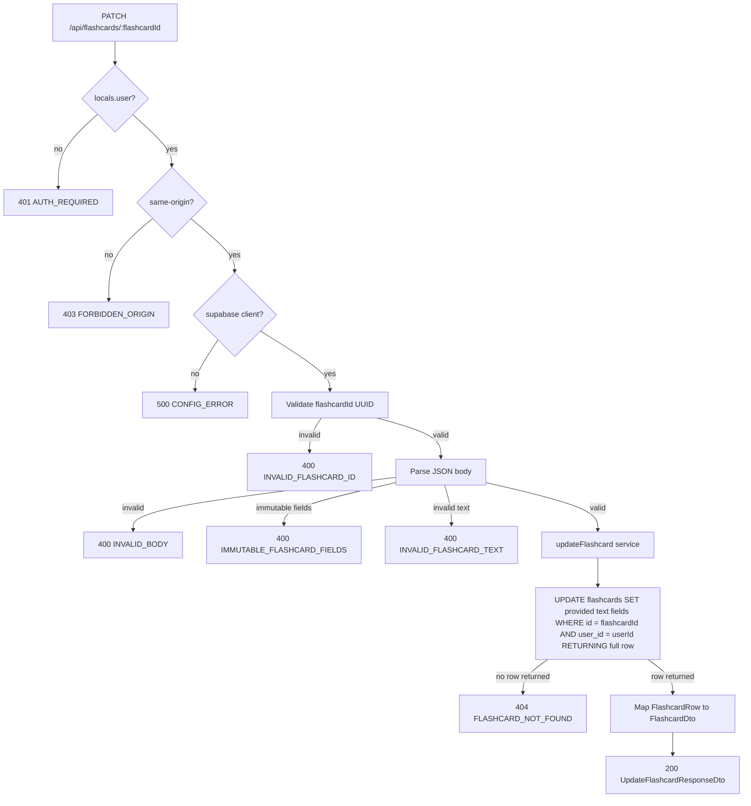

# API Endpoint Implementation Plan: PATCH /api/flashcards/{flashcardId} (Edit Flashcard Text)

## 1. Endpoint Overview

This endpoint updates the editable text fields of one flashcard owned by the authenticated user. It supports changing `frontText`, `backText`, or both, and returns the updated `FlashcardDto`. It must not reset or modify SM-2 scheduling state, deck membership, AI-origin metadata, ownership, or timestamps except for the database-managed `updated_at` column.

The endpoint runs as an Astro SSR API route on Cloudflare Workers and uses Supabase Auth, Supabase RLS, and the existing cookie-based Supabase SSR client. It should share the dynamic route file with the flashcard delete/get endpoints: `src/pages/api/flashcards/[flashcardId].ts`.

Key business rules:

- `flashcardId` is required as a path parameter and must be a valid UUID.
- Only a flashcard where `user_id = auth.uid()` can be edited.
- A non-existent flashcard and a flashcard owned by another user both return `404 FLASHCARD_NOT_FOUND` to prevent resource enumeration.
- Only `frontText` and `backText` are editable.
- `frontText` and `backText` are both optional, but at least one must be present.
- If a text field is present, it is trimmed, validated, and persisted.
- `frontText` is capped at 500 characters and must satisfy the MVP short-question heuristic: reject more than two sentence-ending punctuation marks.
- `backText` is capped at 3000 characters.
- Unknown fields must be rejected. Attempts to update `deckId`, `createdByAi`, `sm2`, `userId`, timestamps, or snake_case DB fields should return `400 IMMUTABLE_FLASHCARD_FIELDS`.
- Updating text must not reset `sm2_interval`, `sm2_repetition`, `sm2_ease_factor`, `due_at`, or `last_reviewed_at`.
- This is a cookie-authenticated mutation, so same-origin CSRF protection applies.

## 2. Request Details

- **HTTP Method:** `PATCH`
- **URL:** `/api/flashcards/{flashcardId}`
- **Route file:** `src/pages/api/flashcards/[flashcardId].ts`
- **Headers:**
  - `Content-Type: application/json` is required.
  - Supabase session cookies are required for authentication.
  - `Origin` should be validated for same-origin CSRF protection; matching origin or missing `Origin` is allowed, cross-origin requests are rejected.
- **Parameters:**
  - **Required:**
    - `flashcardId` (path) — UUID of the flashcard to edit.
  - **Optional:** none.
- **Query parameters:** none.
- **Request Body:** JSON object containing `frontText`, `backText`, or both.

Example request:

```json
{
  "frontText": "What does photosynthesis produce?",
  "backText": "Photosynthesis produces glucose and oxygen from carbon dioxide, water, and light energy."
}
```

Request body field rules:

- `frontText`:
  - Optional string.
  - If present, trim before validation and persistence.
  - Must be non-empty after trimming.
  - Maximum 500 characters.
  - Plain text only; reject HTML-like markup.
  - Must satisfy the short-question rule: reject values with more than two sentence-ending punctuation marks (`.`, `?`, `!`) unless product requirements later soften this into a warning.
- `backText`:
  - Optional string.
  - If present, trim before validation and persistence.
  - Must be non-empty after trimming.
  - Maximum 3000 characters.
  - Plain text only; reject HTML-like markup.
- At least one of `frontText` or `backText` must be present after validation.
- Unknown or immutable fields must be rejected, especially:
  - `deckId`, `deck_id`
  - `createdByAi`, `created_by_ai`
  - `sm2`, `sm2_interval`, `sm2_repetition`, `sm2_ease_factor`, `dueAt`, `due_at`, `lastReviewedAt`, `last_reviewed_at`
  - `userId`, `user_id`
  - `id`, `createdAt`, `created_at`, `updatedAt`, `updated_at`

## 3. Types Used

All public contract types already exist in `src/types.ts`:

- `UpdateFlashcardCommand` — `Partial<CreateFlashcardCommand>`, request command model with optional `frontText` and `backText`.
- `UpdateFlashcardResponseDto` — response DTO: `{ flashcard: FlashcardDto }`.
- `FlashcardDto` — public flashcard representation with camelCase fields and nested SM-2 state.
- `Sm2Dto` — nested SM-2 representation inside `FlashcardDto`.
- `FlashcardRow` — database row shape for `public.flashcards`.
- `ApiErrorDto` — shared error envelope: `{ error: { code, message, details? } }`.

Implementation artifacts to add or extend:

- `src/lib/validation/flashcards.ts`:
  - Reuse `flashcardIdParamSchema` for `{ flashcardId }` UUID validation.
  - Reuse or extract text validators from the create plan.
  - Add `updateFlashcardSchema` for `UpdateFlashcardCommand`.
  - Add a helper/schema branch that distinguishes invalid text from immutable-field attempts.
- `src/lib/services/flashcard.service.ts`:
  - Extend `FlashcardServiceErrorCode` with `FLASHCARD_NOT_FOUND` and `FLASHCARD_UPDATE_FAILED`.
  - Reuse `FlashcardServiceError`.
  - Reuse `toFlashcardDto(row: FlashcardRow): FlashcardDto` from create/get operations.
  - Add `updateFlashcard(supabase, userId, flashcardId, command): Promise<UpdateFlashcardResponseDto>`.

## 4. Response Details

### Success Response

- **200 OK** — `UpdateFlashcardResponseDto`:

```json
{
  "flashcard": {
    "id": "uuid",
    "deckId": "uuid",
    "frontText": "What does photosynthesis produce?",
    "backText": "Photosynthesis produces glucose and oxygen from carbon dioxide, water, and light energy.",
    "createdByAi": false,
    "sm2": {
      "interval": 12,
      "repetition": 4,
      "easeFactor": 2.6,
      "dueAt": "2026-06-20",
      "lastReviewedAt": "2026-06-08"
    },
    "createdAt": "2026-06-11T10:00:00.000Z",
    "updatedAt": "2026-06-16T10:00:00.000Z"
  }
}
```

### Error Responses

All errors must use `jsonError(...)` from `src/lib/api/responses.ts` and the `ApiErrorDto` envelope.

| Status | Error code                   | Condition                                                                                                                                                                                        |
| ------ | ---------------------------- | ------------------------------------------------------------------------------------------------------------------------------------------------------------------------------------------------ |
| 400    | `INVALID_FLASHCARD_ID`       | `flashcardId` is missing or is not a UUID.                                                                                                                                                       |
| 400    | `INVALID_BODY`               | Request body is not valid JSON.                                                                                                                                                                  |
| 400    | `INVALID_FLASHCARD_TEXT`     | Provided `frontText` or `backText` is non-string, empty after trim, too long, contains HTML-like markup, violates the front-text short-question heuristic, or neither editable field is present. |
| 400    | `IMMUTABLE_FLASHCARD_FIELDS` | Request attempts to update `deckId`, `createdByAi`, SM-2 fields, ownership fields, timestamps, `id`, or snake_case database columns.                                                             |
| 401    | `AUTH_REQUIRED`              | No active authenticated session is available in `context.locals.user`.                                                                                                                           |
| 403    | `FORBIDDEN_ORIGIN`           | Cookie-authenticated mutation was sent from a different origin. This follows existing mutation-route behavior.                                                                                   |
| 404    | `FLASHCARD_NOT_FOUND`        | The flashcard does not exist or is not owned by the authenticated user.                                                                                                                          |
| 500    | `CONFIG_ERROR`               | Supabase client cannot be created because server configuration is missing or invalid.                                                                                                            |
| 500    | `FLASHCARD_UPDATE_FAILED`    | Unexpected persistence, RLS, trigger, or mapping failure.                                                                                                                                        |

## 5. Data Flow



Detailed flow:

1. `middleware.ts` resolves the current Supabase user and stores it in `context.locals.user`.
2. The route checks `context.locals.user`. If missing, return `401 AUTH_REQUIRED` before parsing the body.
3. Validate same-origin for this cookie-authenticated mutation.
4. Create the Supabase SSR client with `createClient(context.request.headers, context.cookies)`. If it returns `null`, return `500 CONFIG_ERROR`.
5. Validate `context.params.flashcardId` with a UUID Zod schema. If invalid, return `400 INVALID_FLASHCARD_ID` with structured Zod details.
6. Parse `context.request.json()`. If parsing throws, return `400 INVALID_BODY`.
7. Before or during Zod validation, detect immutable fields. If any immutable key is present, return `400 IMMUTABLE_FLASHCARD_FIELDS`.
8. Validate editable text fields with `updateFlashcardSchema`. If validation fails, return `400 INVALID_FLASHCARD_TEXT` with `z.treeifyError(parsed.error)` in `details`.
9. Build `UpdateFlashcardCommand` containing only provided editable fields.
10. Call `updateFlashcard(supabase, user.id, flashcardId, command)`.
11. The service builds an update payload from the provided command only:
    - `frontText` -> `front_text`
    - `backText` -> `back_text`
12. The service issues a scoped update:
    - `.from("flashcards")`
    - `.update(updatePayload)`
    - `.eq("id", flashcardId)`
    - `.eq("user_id", userId)`
    - `.select("id, user_id, deck_id, front_text, back_text, created_by_ai, sm2_interval, sm2_repetition, sm2_ease_factor, due_at, last_reviewed_at, created_at, updated_at")`
    - `.maybeSingle()`
13. If Supabase returns an error, throw `FlashcardServiceError("FLASHCARD_UPDATE_FAILED", ...)` with the original error as `cause`.
14. If no row is returned, throw `FlashcardServiceError("FLASHCARD_NOT_FOUND", ...)`.
15. Map the returned `FlashcardRow` to `FlashcardDto` without recomputing or resetting SM-2 state.
16. Return `jsonOk(result, 200)`.

## 6. Security Considerations

- **Authentication:** Require `context.locals.user` in the route. Do not rely solely on middleware or protected UI routes.
- **Authorization:** Scope the update by both `id` and the authenticated `user.id`. Never accept `userId` from the client. Supabase RLS provides defense in depth.
- **CSRF:** Validate `Origin` for this cookie-authenticated mutation. Allow missing `Origin` for tests/server-to-server requests if keeping parity with current deck endpoints; reject mismatched origins with `403 FORBIDDEN_ORIGIN`.
- **Resource enumeration:** Return `404 FLASHCARD_NOT_FOUND` for both missing flashcards and flashcards owned by another user. Do not return `403` for foreign resources.
- **Immutable fields:** Reject attempts to update `deckId`, `createdByAi`, SM-2 fields, ownership, timestamps, or identifiers before calling the service.
- **Plain text only:** Reject HTML-like markup at validation time and render flashcard content escaped in the UI. Store flashcards as plain text, not HTML.
- **Parameterized data access:** Use the Supabase query builder only. Do not construct SQL strings from request input.
- **No sensitive logging:** Do not log request bodies or flashcard text. On failures, log technical error objects with a route tag only.
- **Study progress preservation:** Updating text must preserve `sm2_interval`, `sm2_repetition`, `sm2_ease_factor`, `due_at`, and `last_reviewed_at`. The update payload must not include those columns.
- **AI workflow isolation:** Editing a flashcard must not alter `created_by_ai`, AI generation logs, AI credits, or acceptance-rate history.
- **Deck immutability:** Moving a card between decks is out of scope. Reject `deckId` in the body and do not update `deck_id` in the service.

## 7. Error Handling

Use a domain error class in the service and map it in the route.

Recommended service error codes:

- `FLASHCARD_NOT_FOUND` — target flashcard is absent or not owned by the user.
- `FLASHCARD_UPDATE_FAILED` — update failed because of an unexpected Supabase, RLS, trigger, or database issue.

Route mapping:

| Service or validation outcome            | HTTP status | API error code               | Response message guidance                              |
| ---------------------------------------- | ----------- | ---------------------------- | ------------------------------------------------------ |
| Missing `context.locals.user`            | 401         | `AUTH_REQUIRED`              | `Authentication is required to update a flashcard.`    |
| Mismatched request origin                | 403         | `FORBIDDEN_ORIGIN`           | `Cross-origin requests are not allowed.`               |
| Missing/invalid Supabase config          | 500         | `CONFIG_ERROR`               | `The server is not configured correctly.`              |
| Invalid `flashcardId` path param         | 400         | `INVALID_FLASHCARD_ID`       | `Flashcard id is invalid.`                             |
| JSON parse failure                       | 400         | `INVALID_BODY`               | `Request body must be valid JSON.`                     |
| Immutable fields present                 | 400         | `IMMUTABLE_FLASHCARD_FIELDS` | `Only frontText and backText can be updated.`          |
| No editable fields present               | 400         | `INVALID_FLASHCARD_TEXT`     | `At least one flashcard text field is required.`       |
| Zod text validation failure              | 400         | `INVALID_FLASHCARD_TEXT`     | `Flashcard text is invalid.` Include `details.issues`. |
| Service throws `FLASHCARD_NOT_FOUND`     | 404         | `FLASHCARD_NOT_FOUND`        | `Flashcard not found.`                                 |
| Service throws `FLASHCARD_UPDATE_FAILED` | 500         | `FLASHCARD_UPDATE_FAILED`    | `Failed to update flashcard.`                          |
| Unexpected thrown error                  | 500         | `FLASHCARD_UPDATE_FAILED`    | `Failed to update flashcard.`                          |

Additional handling rules:

- Keep all client-facing messages stable and non-technical.
- Include structured Zod details only for client-fixable validation errors.
- Use `console.error("[PATCH /api/flashcards/:flashcardId] ...", error)` for unexpected server errors.
- Do not persist errors to the database because the provided schema has no error-log table and this endpoint does not require audit logging.

## 8. Performance Considerations

- The endpoint performs one database operation in the normal path: a scoped `UPDATE ... RETURNING full row` equivalent through Supabase.
- The update targets the flashcard primary key (`id`) and includes `user_id` as an authorization filter. The primary-key lookup is selective; RLS and the explicit `user_id` filter keep access scoped.
- Use `.select(...)` on the update so the affected-row check and returned DTO need no extra read.
- Do not fetch the parent deck. Authorization is based on `flashcards.user_id` and RLS.
- Do not recompute deck counters or due-card counts in this response. Later list/detail queries can reflect updated text and unchanged scheduling state.
- Keep the update payload minimal: include only fields present in the validated command.
- Keep `export const prerender = false` so the endpoint runs per request in the Cloudflare Workers runtime.

## 9. Implementation Steps

1. **Extend validation** in `src/lib/validation/flashcards.ts`:
   - Reuse or add `flashcardIdParamSchema = z.object({ flashcardId: z.uuid("Flashcard id must be a valid UUID.") })`.
   - Extract shared `frontTextSchema` and `backTextSchema` from the create endpoint validation so create and update enforce identical text rules.
   - Add an immutable-key list for fields that must never be updated through this endpoint.
   - Add `updateFlashcardSchema = z.strictObject({ frontText: frontTextSchema.optional(), backText: backTextSchema.optional() }).refine((value) => value.frontText !== undefined || value.backText !== undefined, { message: "At least one text field is required." })`.
   - Ensure validation can map immutable-key attempts to `IMMUTABLE_FLASHCARD_FIELDS` rather than the generic text error.
   - Export `UpdateFlashcardInput = z.infer<typeof updateFlashcardSchema>`.

2. **Extend the flashcard service** in `src/lib/services/flashcard.service.ts`:
   - Ensure `FlashcardServiceError` exists and supports a readonly `code` plus optional `cause`.
   - Add `"FLASHCARD_NOT_FOUND"` and `"FLASHCARD_UPDATE_FAILED"` to `FlashcardServiceErrorCode`.
   - Reuse `toFlashcardDto(row: FlashcardRow): FlashcardDto`.
   - Implement `updateFlashcard(supabase, userId, flashcardId, command): Promise<UpdateFlashcardResponseDto>`:
     - Build an update payload with only `front_text` and/or `back_text` when present.
     - Update `flashcards` scoped by `.eq("id", flashcardId).eq("user_id", userId)`.
     - Select all columns required for `FlashcardDto`.
     - Throw `FLASHCARD_UPDATE_FAILED` on Supabase error.
     - Throw `FLASHCARD_NOT_FOUND` when no row is returned.
     - Return `{ flashcard: toFlashcardDto(row) }`.

3. **Extend the dynamic route** `src/pages/api/flashcards/[flashcardId].ts`:
   - `export const prerender = false`.
   - Import `APIRoute`, `z`, `createClient`, `jsonError`, `jsonOk`, `flashcardIdParamSchema`, `updateFlashcardSchema`, immutable-field helpers, `updateFlashcard`, `FlashcardServiceError`, `UpdateFlashcardCommand`, and `UpdateFlashcardResponseDto`.
   - Add or reuse the same `isSameOrigin(request)` helper used by other mutation endpoints.
   - Implement `PATCH` with this order:
     1. Require `context.locals.user` -> `401 AUTH_REQUIRED`.
     2. Validate same-origin -> `403 FORBIDDEN_ORIGIN`.
     3. Create Supabase client -> `500 CONFIG_ERROR`.
     4. Validate `context.params.flashcardId` -> `400 INVALID_FLASHCARD_ID`.
     5. Parse JSON -> `400 INVALID_BODY`.
     6. Detect immutable fields -> `400 IMMUTABLE_FLASHCARD_FIELDS`.
     7. Validate editable body -> `400 INVALID_FLASHCARD_TEXT`.
     8. Call `updateFlashcard(...)`.
     9. Map `FLASHCARD_NOT_FOUND` -> `404 FLASHCARD_NOT_FOUND`.
     10. Map service and unexpected failures -> `500 FLASHCARD_UPDATE_FAILED`.
     11. Return `jsonOk(result, 200)`.

4. **Add route tests** in `src/pages/api/flashcards/[flashcardId].test.ts`:
   - Mock `@/lib/supabase` because it depends on `astro:env/server`.
   - Mock `updateFlashcard` while preserving the real `FlashcardServiceError` class for `instanceof` checks.
   - Test success with both fields and with only `frontText` / only `backText`.
   - Test that trimmed text is passed to the service.
   - Test `401 AUTH_REQUIRED` when no user exists.
   - Test `403 FORBIDDEN_ORIGIN` for cross-origin requests and success for same-origin requests.
   - Test `500 CONFIG_ERROR` when `createClient` returns `null`.
   - Test `400 INVALID_FLASHCARD_ID` for a non-UUID path parameter.
   - Test `400 INVALID_BODY` for malformed JSON.
   - Test `400 INVALID_FLASHCARD_TEXT` for empty strings, overly long text, HTML-like input, too many sentence-ending punctuation marks in `frontText`, and no editable fields.
   - Test `400 IMMUTABLE_FLASHCARD_FIELDS` for `deckId`, `createdByAi`, `sm2`, ownership fields, timestamps, `id`, and snake_case DB columns.
   - Test `404 FLASHCARD_NOT_FOUND` when the service throws `FlashcardServiceError("FLASHCARD_NOT_FOUND", ...)`.
   - Test `500 FLASHCARD_UPDATE_FAILED` for service and unexpected errors.

5. **Add service tests** in `src/lib/services/flashcard.service.test.ts`:
   - Verify the update query targets `flashcards` and is scoped by both `id` and `user_id`.
   - Verify only provided fields are included in the update payload.
   - Verify SM-2 fields, `deck_id`, `created_by_ai`, and ownership columns are never included in the update payload.
   - Verify a returned row maps to `FlashcardDto` correctly, including unchanged SM-2 state.
   - Verify no returned row maps to `FLASHCARD_NOT_FOUND`.
   - Verify Supabase update errors map to `FLASHCARD_UPDATE_FAILED`.

6. **Confirm database assumptions**:
   - Ensure RLS on `public.flashcards` allows authenticated users to update only rows where `user_id = auth.uid()`.
   - Ensure the `set_updated_at()` trigger applies to `flashcards` so `updated_at` refreshes automatically.
   - Ensure database constraints for non-empty text and max lengths match or exceed Zod validation. If constraints are missing, keep Zod enforcement and add a separate migration task rather than relying only on application code long-term.
   - Ensure the database does not reset SM-2 fields when only text fields are updated.

7. **Validate implementation**:
   - Run focused tests for the new route and service first.
   - Run `npm run lint` to satisfy type-aware ESLint rules.
   - Run `npm run build` if route/module resolution or Cloudflare SSR behavior changed.
   - Optionally test manually with an authenticated session cookie:
     - Valid owned `flashcardId` and text update -> `200`.
     - Invalid `flashcardId` -> `400`.
     - Empty or too-long text -> `400`.
     - Immutable-field attempt -> `400`.
     - Foreign or missing flashcard -> `404`.
     - Missing session -> `401`.
     - Cross-origin mutation -> `403`.
