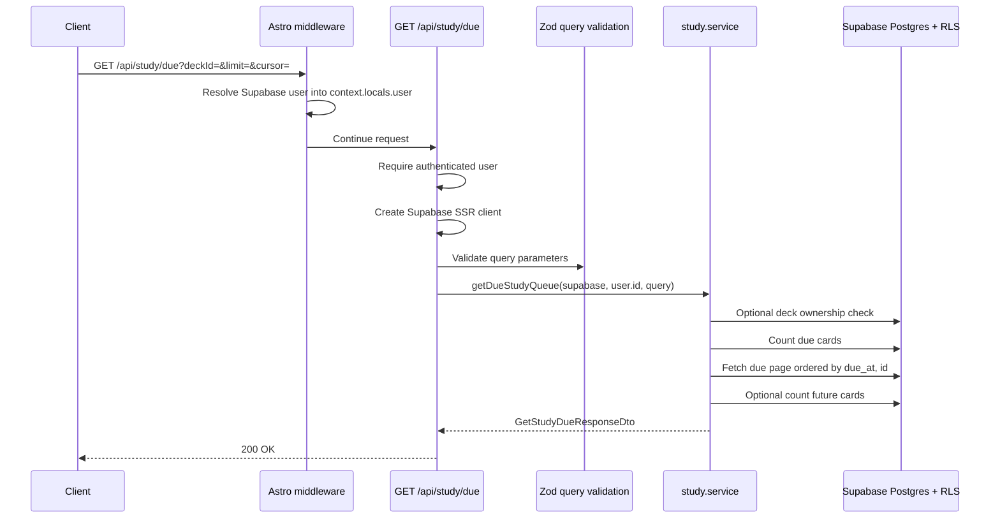

# API Endpoint Implementation Plan: GET /api/study/due

## 1. Endpoint Overview

This endpoint returns due flashcards for the authenticated user, optionally scoped to one user-owned deck. It supports cursor pagination, a bounded page size, and a summary block for Study Mode UI counters.

A flashcard is due when `due_at <= current_date`. The endpoint must return only due card content in `data`; if `includeFuturePreview` is enabled, future cards are counted in `summary.upcomingCount` but their content is not returned.

The implementation should follow existing project patterns: Astro SSR API routes, Supabase cookie-based auth, `context.locals.user`, Supabase query builder with RLS, Zod validation, service-layer business logic, DTOs from `src/types.ts`, and `jsonOk` / `jsonError` response helpers.

Key business rules:

- All queries are scoped to the authenticated user's `user_id`.
- Optional `deckId` filtering must verify the deck belongs to the current user.
- Missing and foreign decks both return `404 DECK_NOT_FOUND`.
- `limit` defaults to `20` and is capped at `100`.
- Cursor pagination must be stable and scoped to the query shape.
- No review-history table or persistent error-log table exists in the schema, so this endpoint should not write to any table.

## 2. Request Details

- **HTTP method:** `GET`
- **URL structure:** `/api/study/due`
- **Astro route file:** `src/pages/api/study/due.ts`
- **Runtime:** Astro SSR route on Cloudflare Workers; export `const prerender = false`.
- **Authentication:** Required via Supabase session cookies resolved into `context.locals.user`.
- **Request body:** none.

### Parameters

- **Required:** none.
- **Optional query parameters:**
  - `deckId`: UUID. If provided, return due cards only from this deck after verifying the deck belongs to the user.
  - `limit`: integer. Default `20`, minimum `1`, maximum `100`.
  - `cursor`: opaque string returned from a previous response page.
  - `includeFuturePreview`: boolean. Default `false`. If true, include a small count of future cards in `summary.upcomingCount`; do not return future card content in `data`.

### Query Example

```http
GET /api/study/due?deckId=11111111-1111-4111-8111-111111111111&limit=20&includeFuturePreview=true
```

### Validation Rules

- Parse query parameters from `new URL(context.request.url).searchParams`.
- Validate with a Zod schema in `src/lib/validation/study.ts`.
- `deckId`, when present, must be a valid UUID.
- `limit` should be coerced to an integer, default to `20`, and be constrained to `1..100`.
- `cursor`, when present, must be a non-empty string and later decoded/validated by pagination helpers.
- `includeFuturePreview` should parse common query values such as `true`, `false`, `1`, and `0` if the API chooses to support them.
- Unknown query parameters may be ignored, matching the existing list endpoint style.

## 3. Types Used

Use existing shared types from `src/types.ts`:

- `GetStudyDueQuery` - query model for `GET /api/study/due`.
- `GetStudyDueResponseDto` - response body for the due queue.
- `StudyQueueItemDto` - due-card item returned by the queue; omits `createdByAi`, `createdAt`, and `updatedAt`.
- `StudyDueSummaryDto` - aggregate queue summary containing `dueCount`, `suggestedTodayCount`, and `upcomingCount`.
- `PaginationDto` and `PaginationQuery` - cursor pagination contracts.
- `FlashcardDto` and `FlashcardRow` - source types for mapping rows to queue items.
- `ApiErrorDto` - shared error envelope.

Implementation artifacts to add:

- `src/lib/validation/study.ts`
  - `studyDueQuerySchema`
  - `StudyDueInput = z.infer<typeof studyDueQuerySchema>`
- `src/lib/services/study.service.ts`
  - `StudyServiceErrorCode`
  - `StudyServiceError`
  - `getDueStudyQueue(supabase, userId, query): Promise<GetStudyDueResponseDto>`
  - `toStudyQueueItemDto(row)` helper, reusing `toFlashcardDto(row)` where practical.

## 4. Response Details

### Success Response

- **Status:** `200 OK`
- **Body:** `GetStudyDueResponseDto`

```json
{
  "data": [
    {
      "id": "22222222-2222-4222-8222-222222222222",
      "deckId": "11111111-1111-4111-8111-111111111111",
      "frontText": "What is osmosis?",
      "backText": "Osmosis is the movement of water through a semipermeable membrane from lower solute concentration to higher solute concentration.",
      "sm2": {
        "interval": 0,
        "repetition": 0,
        "easeFactor": 2.5,
        "dueAt": "2026-06-16",
        "lastReviewedAt": null
      }
    }
  ],
  "pagination": {
    "nextCursor": "opaque-cursor-or-null",
    "hasMore": true
  },
  "summary": {
    "dueCount": 34,
    "suggestedTodayCount": 25,
    "upcomingCount": 18
  }
}
```

Response notes:

- `data` contains only due cards, never future cards.
- `StudyQueueItemDto` omits `createdByAi`, `createdAt`, and `updatedAt`.
- `dueCount` is the total number of due cards matching the current user and optional deck filter.
- `suggestedTodayCount` should be a capped recommendation for the UI, for example `min(dueCount, 25)`, unless product requirements define a different cap.
- `upcomingCount` should be `0` when `includeFuturePreview` is false; when true, count future cards without returning their content.

### Error Response Envelope

All errors must use `jsonError(...)` and the shared envelope:

```json
{
  "error": {
    "code": "ERROR_CODE",
    "message": "Human-readable message",
    "details": {}
  }
}
```

## 5. Data Flow



Detailed flow:

1. Require `context.locals.user`; return `401 AUTH_REQUIRED` if absent.
2. Create the Supabase SSR client; return `500 CONFIG_ERROR` if unavailable.
3. Parse query parameters into a plain object.
4. Validate query parameters with `studyDueQuerySchema`.
5. If `deckId` is provided, verify `decks.id = deckId` and `decks.user_id = userId`; return `404 DECK_NOT_FOUND` if no row matches.
6. Build the base flashcard query scoped by `user_id = userId` and `due_at <= today`.
7. Add `deck_id = deckId` when provided.
8. Apply cursor pagination using stable ordering such as `due_at ASC, id ASC`.
9. Fetch `limit + 1` rows to compute `hasMore` and `nextCursor`.
10. Count all due cards matching the same user/deck filter for `summary.dueCount` using `head: true`.
11. Set `summary.suggestedTodayCount` to a product cap such as `min(dueCount, 25)`.
12. If `includeFuturePreview` is true, count future cards where `due_at > today`; otherwise return `upcomingCount: 0`.
13. Map rows to `StudyQueueItemDto` and return `jsonOk(result, 200)`.

## 6. Security Considerations

- **Authentication:** Enforce `context.locals.user` directly and return `401 AUTH_REQUIRED` when absent.
- **Authorization:** All reads must be scoped by `user_id = user.id`. Do not accept `userId` from query parameters.
- **RLS:** Supabase RLS should restrict `flashcards` and `decks` by `auth.uid()`. Keep explicit `user_id` filters as defense in depth.
- **Deck filter ownership:** Verify optional `deckId` belongs to the user before using it as a filter. Return `404 DECK_NOT_FOUND` for missing or foreign decks.
- **Plain-text content:** The endpoint returns existing flashcard text only. UI rendering must escape text; the endpoint should not transform flashcards into HTML.
- **Logging:** Do not log flashcard content, session cookies, or full request URLs if they might include sensitive cursor values. Log technical errors with route tags only.
- **No persistent error storage:** The provided database schema has no error table, so errors should be logged at runtime only.
- **CSRF:** This is a read endpoint and does not need CSRF protection, but it still requires authentication.

## 7. Error Handling

| Scenario                                              | HTTP status | Error code           | Handling                                  |
| ----------------------------------------------------- | ----------- | -------------------- | ----------------------------------------- |
| Missing authenticated session                         | `401`       | `AUTH_REQUIRED`      | Return before querying Supabase.          |
| Supabase client unavailable                           | `500`       | `CONFIG_ERROR`       | Return stable configuration error.        |
| Invalid `deckId`, `limit`, `cursor`, or boolean query | `400`       | `INVALID_QUERY`      | Include Zod issues in `details`.          |
| `deckId` does not belong to the user                  | `404`       | `DECK_NOT_FOUND`     | Treat missing and foreign decks the same. |
| Due-card query fails                                  | `500`       | `STUDY_QUEUE_FAILED` | Log technical error without card content. |
| Summary count query fails                             | `500`       | `STUDY_QUEUE_FAILED` | Return generic queue failure.             |
| Unexpected exception                                  | `500`       | `STUDY_QUEUE_FAILED` | Catch at route boundary.                  |

Recommended service error codes:

- `DECK_NOT_FOUND`
- `STUDY_QUEUE_FAILED`

## 8. Performance Considerations

- Use the existing `idx_flashcards_user_id_due_at` index for the unscoped due queue.
- Use `idx_flashcards_deck_id_due_at` or `idx_flashcards_user_id_deck_id` for deck-scoped queues.
- Order due queue pages by `due_at ASC, id ASC` for stable cursor pagination.
- Fetch `limit + 1` rows to determine `hasMore` without a second page query.
- Use `head: true` count queries for `dueCount` and `upcomingCount`; do not transfer rows just to count.
- Keep `includeFuturePreview` as a count-only option. Never return future card content from the due queue.
- Keep `limit` capped at `100` to protect response size and Cloudflare execution time.
- Compare `date` columns using `YYYY-MM-DD` strings from `new Date().toISOString().slice(0, 10)` to match existing service conventions.

## 9. Implementation Steps

1. **Create study validation module**
   - Add `src/lib/validation/study.ts`.
   - Define `studyDueQuerySchema` with `deckId`, `limit`, `cursor`, and `includeFuturePreview`.
   - Add helpers for parsing boolean query values such as `true`, `false`, `1`, and `0` if the current API style supports them.
   - Export `StudyDueInput` for service and tests.

2. **Create study service module**
   - Add `src/lib/services/study.service.ts`.
   - Import `SupabaseClient`, Study Mode DTOs, `FlashcardRow`, and the existing `toFlashcardDto` mapper from `flashcard.service.ts`.
   - Define `StudyServiceError` and `StudyServiceErrorCode`.
   - Define a shared `FLASHCARD_COLUMNS` selection or export/reuse the existing flashcard columns if appropriate.

3. **Implement cursor helpers**
   - Encode cursor payloads as base64url JSON containing at least `{ dueAt, id }`.
   - Decode and validate cursors in the validation or service layer.
   - Scope cursor meaning to the current user and query shape. If stronger tamper resistance is required, sign cursors with a server secret; otherwise reject malformed cursors as `INVALID_QUERY`.

4. **Implement `getDueStudyQueue`**
   - Verify optional deck ownership with `decks.id` and `decks.user_id`.
   - Build a due query scoped by `flashcards.user_id = userId` and `due_at <= today`.
   - Add `deck_id = deckId` when provided.
   - Apply stable ordering and cursor filters.
   - Fetch `limit + 1` rows, trim to `limit`, and compute pagination.
   - Count all matching due cards for `summary.dueCount`.
   - Compute `summary.suggestedTodayCount` with a documented cap.
   - Count future cards only when `includeFuturePreview` is true.
   - Map rows to `StudyQueueItemDto`.

5. **Implement route**
   - Add `src/pages/api/study/due.ts`.
   - Export `prerender = false`.
   - Require authentication.
   - Create Supabase client and guard `CONFIG_ERROR`.
   - Validate query with `studyDueQuerySchema`.
   - Call `getDueStudyQueue(...)`.
   - Map service errors to `400`, `404`, or `500` as specified.

6. **Add route tests**
   - Add `src/pages/api/study/due.test.ts`.
   - Mock `createClient` and `getDueStudyQueue`.
   - Test `200` success, auth failure, config failure, invalid query, `DECK_NOT_FOUND`, and generic service failures.

7. **Add service tests**
   - Add or extend `src/lib/services/study.service.test.ts`.
   - Test due queue ownership filtering, due filtering, pagination, summary counts, and future preview count.
   - Test `DECK_NOT_FOUND` for foreign deck filters.
   - Test query failures and malformed cursor handling.

8. **Add validation tests**
   - Add or extend validation tests for `studyDueQuerySchema`.
   - Cover default limit, max limit, invalid UUIDs, invalid cursors, and boolean parsing.

9. **Verify database alignment**
   - Confirm RLS is enabled on `flashcards` and `decks`.
   - Confirm indexes exist for `flashcards(user_id, due_at)` and `flashcards(deck_id, due_at)`.
   - Confirm `due_at` is a `date` column.

10. **Run focused validation**
    - Run study validation, service, and route tests.
    - Run existing flashcard and deck tests to catch shared mapper regressions.
    - Run `npm run lint`.
    - Run `npm run build` before merging because new Astro API routes affect production build output.
