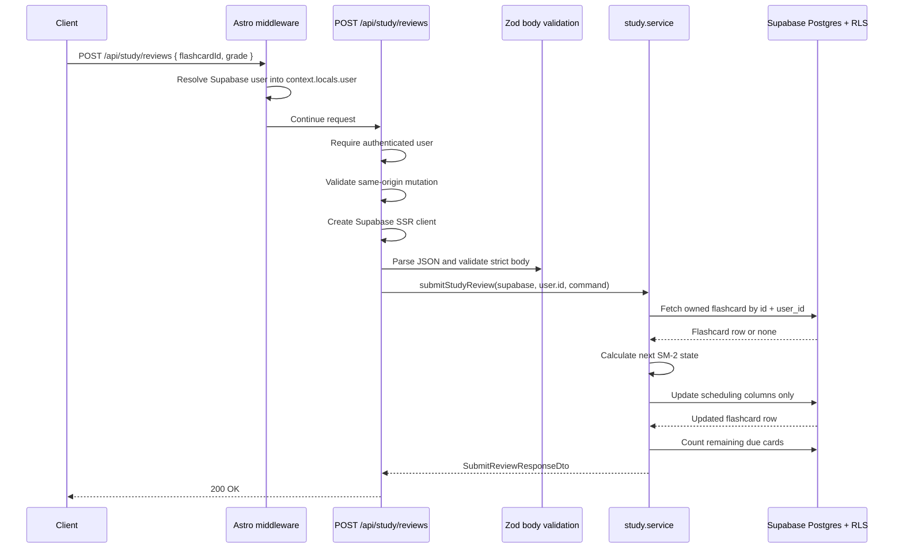

# API Endpoint Implementation Plan: POST /api/study/reviews

## 1. Endpoint Overview

This endpoint records a study review for one authenticated user's flashcard and updates the card's SM-2 scheduling state. The client submits only `flashcardId` and `grade`; the server computes all changes to `sm2_interval`, `sm2_repetition`, `sm2_ease_factor`, `due_at`, and `last_reviewed_at`.

The endpoint operates on `public.flashcards`. It does not create review-history rows because review history is outside MVP scope and no review-history table exists in the database schema.

The implementation should follow existing project patterns: Astro SSR API routes, Supabase cookie-based auth, `context.locals.user`, same-origin protection for cookie-authenticated mutations, Supabase query builder with RLS, Zod validation, service-layer business logic, DTOs from `src/types.ts`, and `jsonOk` / `jsonError` response helpers.

Key business rules:

- The reviewed flashcard must exist and belong to the authenticated user.
- Missing and foreign flashcards both return `404 FLASHCARD_NOT_FOUND`.
- Supported grades are `again`, `hard`, `good`, and `easy`.
- The server maps grades to SM-2 quality values and computes the next schedule.
- `last_reviewed_at` is set to current date.
- `due_at` is set to current date plus the newly computed interval.
- The update must not modify card text, deck membership, ownership, AI-origin metadata, or client-controlled timestamps.
- No persistent error-log table exists in the schema, so errors should not be inserted into the database.

## 2. Request Details

- **HTTP method:** `POST`
- **URL structure:** `/api/study/reviews`
- **Astro route file:** `src/pages/api/study/reviews.ts`
- **Runtime:** Astro SSR route on Cloudflare Workers; export `const prerender = false`.
- **Authentication:** Required via Supabase session cookies resolved into `context.locals.user`.

### Headers

- `Content-Type: application/json`
- Supabase auth/session cookies.
- `Origin` should be validated for same-origin browser mutations, following existing mutation endpoint patterns.

### Parameters

- **Required body fields:**
  - `flashcardId`: UUID of the reviewed flashcard.
  - `grade`: one of `again`, `hard`, `good`, `easy`.
- **Optional:** none.
- **Query parameters:** none.

### Request Body

```json
{
  "flashcardId": "22222222-2222-4222-8222-222222222222",
  "grade": "good"
}
```

### Validation Rules

- Parse JSON with `context.request.json()`.
- Return `400 INVALID_BODY` when the request body is not valid JSON.
- Validate with `submitReviewSchema` in `src/lib/validation/study.ts`.
- `flashcardId` must be a valid UUID.
- `grade` must be one of `again`, `hard`, `good`, or `easy`.
- Reject unknown body fields using `z.strictObject(...)` so clients cannot submit SM-2 fields directly.
- Use distinct error codes for invalid ID, invalid grade, and unknown payload fields if the route inspects Zod issues; otherwise document the route's chosen mapping in tests.

## 3. Types Used

Use existing shared types from `src/types.ts`:

- `SubmitReviewCommand` - request command model for review submission.
- `SubmitReviewResponseDto` - response body for a submitted review.
- `ReviewGrade` - allowed grade union: `again | hard | good | easy`.
- `FlashcardDto` - returned after review update.
- `FlashcardRow` - database row shape for `public.flashcards`.
- `ApiErrorDto` - shared error envelope.

Implementation artifacts to add:

- `src/lib/validation/study.ts`
  - `submitReviewSchema`
  - `SubmitReviewInput = z.infer<typeof submitReviewSchema>`
- `src/lib/services/study.service.ts`
  - `StudyServiceErrorCode`
  - `StudyServiceError`
  - `submitStudyReview(supabase, userId, command): Promise<SubmitReviewResponseDto>`
  - `calculateSm2Schedule(currentSm2, grade, today)` helper.

Useful existing artifacts:

- `toFlashcardDto(row)` from `src/lib/services/flashcard.service.ts` for mapping the updated row to `FlashcardDto`.
- Shared `jsonOk` and `jsonError` from `src/lib/api/responses.ts`.

## 4. Response Details

### Success Response

- **Status:** `200 OK`
- **Body:** `SubmitReviewResponseDto`

```json
{
  "flashcard": {
    "id": "22222222-2222-4222-8222-222222222222",
    "deckId": "11111111-1111-4111-8111-111111111111",
    "frontText": "What is osmosis?",
    "backText": "Osmosis is the movement of water through a semipermeable membrane from lower solute concentration to higher solute concentration.",
    "createdByAi": true,
    "sm2": {
      "interval": 1,
      "repetition": 1,
      "easeFactor": 2.5,
      "dueAt": "2026-06-17",
      "lastReviewedAt": "2026-06-16"
    },
    "createdAt": "2026-06-11T10:00:00.000Z",
    "updatedAt": "2026-06-16T10:15:00.000Z"
  },
  "nextDueCount": 33
}
```

Response notes:

- `flashcard` is the updated `FlashcardDto`, including metadata and `createdByAi` because this endpoint returns the full reviewed card.
- `nextDueCount` is the remaining count of due flashcards for the authenticated user after the update.
- If the product later scopes review sessions by deck, consider adding a deck-scoped `nextDueCount`; the current API contract defines a user-level remaining due count.

### Error Response Envelope

All errors must use `jsonError(...)` and the shared envelope:

```json
{
  "error": {
    "code": "ERROR_CODE",
    "message": "Human-readable message",
    "details": {}
  }
}
```

## 5. Data Flow



Detailed flow:

1. Require `context.locals.user`; return `401 AUTH_REQUIRED` if absent.
2. Validate same-origin mutation using the existing route helper pattern for cookie-authenticated writes.
3. Create the Supabase SSR client; return `500 CONFIG_ERROR` if unavailable.
4. Parse JSON body; return `400 INVALID_BODY` on parse failure.
5. Validate with `submitReviewSchema` and reject unknown fields.
6. Fetch the target flashcard by `id` and `user_id` using `.maybeSingle()`.
7. If no row is found, return `404 FLASHCARD_NOT_FOUND`.
8. Map the submitted grade to an SM-2 quality value:
   - `again` -> `2`
   - `hard` -> `3`
   - `good` -> `4`
   - `easy` -> `5`
9. Calculate the new scheduling state server-side.
10. Update only `sm2_interval`, `sm2_repetition`, `sm2_ease_factor`, `due_at`, and `last_reviewed_at`.
11. Return the updated flashcard DTO.
12. Count remaining due cards for the user after the update and include `nextDueCount`.
13. Return `jsonOk(result, 200)`.

## 6. Security Considerations

- **Authentication:** Enforce `context.locals.user` directly and return `401 AUTH_REQUIRED` when absent.
- **Authorization:** Fetch and update flashcards with `id = flashcardId` and `user_id = user.id`. Do not accept `userId` from the client.
- **RLS:** Supabase RLS should restrict `flashcards` by `auth.uid()`. Keep explicit `user_id` filters as defense in depth.
- **Review ownership:** Return `404 FLASHCARD_NOT_FOUND` for missing or foreign flashcards to avoid resource enumeration.
- **CSRF:** This endpoint mutates cookie-authenticated state, so validate `Origin` or `Referer` for same-origin requests.
- **Immutable scheduling control:** Clients must not submit `sm2` fields, `dueAt`, `lastReviewedAt`, intervals, `deckId`, `createdByAi`, or text fields. The server computes all scheduling updates.
- **Plain-text content:** The endpoint returns existing flashcard text only. UI rendering must escape text; the endpoint should not transform flashcards into HTML.
- **Logging:** Do not log flashcard content, request bodies, session cookies, or Supabase secrets. Log technical errors with route tags only.
- **No persistent error storage:** The provided database schema has no error table, so errors should be logged at runtime only.
- **Rate limiting:** Apply generous but bounded rate limits to review submissions by authenticated user and IP at the Cloudflare layer to prevent accidental loops.

## 7. Error Handling

| Scenario                                           | HTTP status | Error code               | Handling                                           |
| -------------------------------------------------- | ----------- | ------------------------ | -------------------------------------------------- |
| Missing authenticated session                      | `401`       | `AUTH_REQUIRED`          | Return before parsing the body.                    |
| Cross-origin browser mutation                      | `403`       | `FORBIDDEN_ORIGIN`       | Reject before persistence.                         |
| Supabase client unavailable                        | `500`       | `CONFIG_ERROR`           | Return stable configuration error.                 |
| Invalid JSON body                                  | `400`       | `INVALID_BODY`           | Return before service call.                        |
| Invalid or missing `flashcardId`                   | `400`       | `INVALID_FLASHCARD_ID`   | Include Zod issues in `details`.                   |
| Invalid or missing `grade`                         | `400`       | `INVALID_REVIEW_GRADE`   | Include Zod issues in `details`.                   |
| Unknown request body fields                        | `400`       | `INVALID_REVIEW_PAYLOAD` | Reject via strict schema.                          |
| Flashcard missing or foreign                       | `404`       | `FLASHCARD_NOT_FOUND`    | Prevent resource enumeration.                      |
| Optimistic concurrency check fails, if implemented | `409`       | `REVIEW_CONFLICT`        | Ask client to reload current card state.           |
| Scheduling update fails                            | `500`       | `REVIEW_SAVE_FAILED`     | Log technical error only.                          |
| Remaining due count fails                          | `500`       | `REVIEW_SAVE_FAILED`     | Prefer failing the whole response for consistency. |
| Unexpected exception                               | `500`       | `REVIEW_SAVE_FAILED`     | Catch at route boundary.                           |

Recommended service error codes:

- `FLASHCARD_NOT_FOUND`
- `REVIEW_SAVE_FAILED`
- `REVIEW_CONFLICT` if optimistic concurrency is implemented.

## 8. Performance Considerations

- Review submission should normally use one select, one update returning the row, and one count query.
- Use `idx_flashcards_user_id_due_at` for the remaining due count.
- Use `.update(...).eq("id", flashcardId).eq("user_id", userId).select(...).maybeSingle()` to avoid a follow-up read.
- Use `head: true` for `nextDueCount`; do not transfer rows just to count.
- Compare `date` columns using `YYYY-MM-DD` strings from `new Date().toISOString().slice(0, 10)` to match existing service conventions.
- Consider an RPC if optimistic concurrency or fully transactional count consistency becomes important. For MVP, a service-level sequence is acceptable if tests document behavior.
- Avoid adding review history or analytics writes unless product scope changes; extra writes would increase latency and require new schema/RLS design.

## 9. Implementation Steps

1. **Create study validation module**
   - Add `src/lib/validation/study.ts` if it does not already exist.
   - Define `submitReviewSchema = z.strictObject({ flashcardId: z.uuid(...), grade: z.enum(["again", "hard", "good", "easy"]) })`.
   - Export `SubmitReviewInput` for service and tests.
   - Add validation tests for invalid UUIDs, invalid grades, missing fields, and unknown fields.

2. **Create study service module**
   - Add `src/lib/services/study.service.ts` if it does not already exist.
   - Import `SupabaseClient`, `SubmitReviewCommand`, `SubmitReviewResponseDto`, `ReviewGrade`, `FlashcardRow`, and the existing `toFlashcardDto` mapper from `flashcard.service.ts`.
   - Define `StudyServiceError` and `StudyServiceErrorCode`.
   - Define or reuse a `FLASHCARD_COLUMNS` selection that returns all columns needed for `FlashcardDto`.

3. **Implement SM-2 calculation helper**
   - Map grades to quality values: `again = 2`, `hard = 3`, `good = 4`, `easy = 5`.
   - If quality is below `3`, set `repetition = 0` and schedule soon, for example `interval = 0` or `1` based on product choice.
   - If quality is at least `3`, increment repetition.
   - Use standard SM-2 intervals: first successful repetition `1`, second `6`, later `round(previousInterval * easeFactor)`.
   - Update ease factor using the SM-2 formula and clamp to a practical minimum such as `1.30`.
   - Set `lastReviewedAt = today` and `dueAt = today + interval days`.
   - Keep all date outputs as `YYYY-MM-DD`.

4. **Implement `submitStudyReview`**
   - Fetch the owned flashcard by `id` and `user_id`.
   - Throw `FLASHCARD_NOT_FOUND` if no row matches.
   - Calculate the next SM-2 state server-side.
   - Update only scheduling columns.
   - Select and return the updated row.
   - Count remaining due cards for the authenticated user after the update.
   - Return `{ flashcard, nextDueCount }`.

5. **Implement route**
   - Add `src/pages/api/study/reviews.ts`.
   - Export `prerender = false`.
   - Require authentication.
   - Validate same-origin mutation requests.
   - Create Supabase client and guard `CONFIG_ERROR`.
   - Parse JSON and validate body with `submitReviewSchema`.
   - Call `submitStudyReview(...)`.
   - Map service errors to `404`, `409`, or `500` as specified.

6. **Add route tests**
   - Add `src/pages/api/study/reviews.test.ts`.
   - Mock `createClient` and `submitStudyReview`.
   - Test `200` success, auth failure, same-origin rejection, config failure, invalid JSON, invalid flashcard ID, invalid grade, unknown fields, `FLASHCARD_NOT_FOUND`, `REVIEW_CONFLICT`, and generic failures.

7. **Add service tests**
   - Add or extend `src/lib/services/study.service.test.ts`.
   - Test review grade mapping and SM-2 calculations for `again`, `hard`, `good`, and `easy`.
   - Test that review updates only scheduling fields and never text, deck, AI, ownership, or timestamp fields except DB-managed `updated_at`.
   - Test `FLASHCARD_NOT_FOUND`, query failures, update failures, and due-count failures.

8. **Verify database alignment**
   - Confirm RLS is enabled on `flashcards`.
   - Confirm `due_at` and `last_reviewed_at` are `date` columns.
   - Confirm the update trigger manages `updated_at`.
   - Confirm no review-history table is required for MVP.

9. **Run focused validation**
   - Run study validation, service, and route tests.
   - Run existing flashcard tests to catch shared mapper regressions.
   - Run `npm run lint`.
   - Run `npm run build` before merging because the new Astro API route affects production build output.
